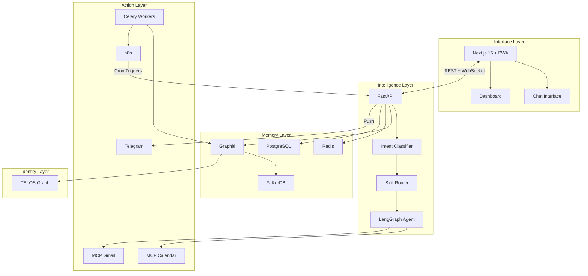

# PAI-X Systemarchitektur

**Version:** 1.0
**Datum:** 2026-02-26
**Basis:** PRD v1.0

---

## 1. Architektur-Ueberblick

PAI-X ist als 5-Schichten-Architektur aufgebaut. Jede Schicht hat eine klar definierte Verantwortung und kommuniziert ueber definierte Interfaces mit den anderen Schichten.

```
┌─────────────────────────────────────────────────────────────────────┐
│                     SCHICHT 5: INTERFACE LAYER                      │
│              Next.js 16 + shadcn/ui + PWA                           │
│         Chat | Dashboard | Voice (Phase 2) | Notifications          │
└──────────────────────────────┬──────────────────────────────────────┘
                               │ REST / WebSocket / Socket.io
┌──────────────────────────────▼──────────────────────────────────────┐
│                  SCHICHT 2: INTELLIGENCE LAYER                      │
│                    FastAPI + LangGraph                               │
│      Intent Classification → Skill Routing → Orchestrierung         │
│              Context Enrichment → Output + Memory Update            │
└──────────┬───────────────────────────────────┬──────────────────────┘
           │                                   │
┌──────────▼────────────────┐    ┌─────────────▼──────────────────────┐
│  SCHICHT 3: MEMORY LAYER  │    │  SCHICHT 4: ACTION LAYER           │
│  Graphiti + FalkorDB      │    │  n8n + MCP Server                   │
│  PostgreSQL + Redis       │    │  Gmail / Calendar / Drive           │
│                           │    │  Contacts / NocoDB / Telegram       │
│  - Episodisches Memory    │    │                                     │
│  - Semantische Suche      │    │  Celery Workers (Background Jobs)   │
│  - Temporale Queries      │    │                                     │
└───────────────────────────┘    └─────────────────────────────────────┘
           │
┌──────────▼────────────────────────────────────────────────────────────┐
│                    SCHICHT 1: IDENTITY LAYER                          │
│                           TELOS                                       │
│    Mission | Goals | Projects | Beliefs | Models                      │
│    Strategies | Narratives | Learned | Challenges | Ideas             │
│    (Gespeichert als Graphiti-Nodes, editierbar im Dashboard)          │
└───────────────────────────────────────────────────────────────────────┘
```

---

## 2. Schicht-Details

### Schicht 1: Identity Layer (TELOS)

**Verantwortung:** Das strukturierte Selbst-Modell des Nutzers. Gibt dem gesamten System den "Nordstern" — wer ist der Nutzer, was will er, was treibt ihn an.

**Technologie:** Graphiti Temporal Knowledge Graph (FalkorDB Backend)

**10 Dimensionen:**
1. **MISSION** — Uebergeordneter Lebens-/Arbeitszweck
2. **GOALS** — Konkrete Ziele (90 Tage, 1 Jahr, 5 Jahre)
3. **PROJECTS** — Aktive Projekte mit Status und Kontext
4. **BELIEFS** — Grundueberzeugungen
5. **MODELS** — Mentale Modelle und Frameworks
6. **STRATEGIES** — Aktuelle Strategien pro Lebensbereich
7. **NARRATIVES** — Selbst-Narrative (Bio, Pitch, etc.)
8. **LEARNED** — Erkenntnisse aus Erfahrungen
9. **CHALLENGES** — Aktuelle Hindernisse
10. **IDEAS** — Ideen-Pool (ungefiltert)

**Befuellung:** Erstmaliges Setup-Interview (30-60 Min) + kontinuierliche Updates durch den Agenten + manuelle Edits im Dashboard.

**Datenfluss:** TELOS wird als Hintergrund-Kontext in JEDE LLM-Anfrage injiziert.

---

### Schicht 2: Intelligence Layer

**Verantwortung:** Das Gehirn des Systems. Empfaengt alle Anfragen, entscheidet was zu tun ist, orchestriert die Ausfuehrung.

**Technologie:** FastAPI (REST + WebSocket) + LangGraph (Agent-Orchestrierung) + Anthropic Claude API

**Request-Flow:**
```
1. Anfrage kommt rein (Text / Voice-Transkript / Cron-Trigger)
       │
2. Intent Classification
   "Was will der Nutzer? Welcher Skill ist zustaendig?"
       │
3. Context Enrichment (Graphiti Query)
   "Was wissen wir ueber dieses Thema? Welche Personen? Letzter Stand?"
       │
4. TELOS Injection
   "Wer ist der Nutzer? Was sind seine Ziele?"
       │
5. Skill Routing
   "Deterministische Logik (Keywords, Regex) → oder LLM Classification"
       │
6. Skill Execution (via LangGraph)
   "Skill ausfuehren mit vollem Kontext"
       │
7. Output generieren + Memory Update (Graphiti)
   "Ergebnis zurueck + neue Infos speichern"
```

**LangGraph:** Wird fuer Stateful Workflows, Conditional Routing und (ab Phase 2) parallele Agent-Ausfuehrung genutzt. Im MVP: Single-Agent mit Skill-Routing.

**LLM:** Anthropic Claude API
- Standard: claude-sonnet-4-5 (schnell, kosteneffizient)
- Komplexe Tasks: claude-opus-4 (tiefes Reasoning)

---

### Schicht 3: Memory Layer

**Verantwortung:** Langzeitgedaechtnis des Systems. Speichert alle Interaktionen, Personen, Meetings, Ideen als vernetzte, zeitbewusste Nodes.

**Technologie:**
| Komponente | Zweck |
|------------|-------|
| Graphiti | Temporal Knowledge Graph Framework (by Zep AI) |
| FalkorDB | Graph-Datenbank Backend (Cypher Queries) |
| PostgreSQL 16 | Relationale Daten (Users, Sessions, Configs) |
| Redis 7.x | Session Store, Cache, Message Queue |

**Warum Graphiti statt Flat Files:**
- Zeitdimension: Wann wurde etwas gesagt/entschieden?
- Relationen: Verbindungen zwischen Entitaeten (Person → Meeting → Projekt)
- Komplexe Queries: "Alle offenen Themen mit Kunden seit Januar"
- Automatische Verknuepfung neuer Informationen mit Bestehendem

**Memory-Zugriff:** Jede Anfrage an den Intelligence Layer loest automatisch einen Graphiti-Query aus (Context Enrichment). Nach jeder Interaktion wird Memory automatisch aktualisiert.

---

### Schicht 4: Action Layer

**Verantwortung:** Die Haende des Systems. Verbindet PAI-X mit der Aussenwelt.

**Technologie:**
| Komponente | Zweck |
|------------|-------|
| n8n (self-hosted) | Workflow Automation, Cron-Jobs |
| MCP Server | Tool-Integration (Gmail, Calendar, Drive) |
| Celery 5.x | Async Background Tasks |
| NocoDB | Strukturierte Daten (Content-Kalender, Templates) |

**MCP Server (Phase 1):**
- Google Calendar — Termine anzeigen, erstellen, bearbeiten
- Gmail — E-Mails lesen, verfassen, senden
- Telegram — Push Notifications

**MCP Server (Phase 2+):**
- Google Drive — Dateien suchen, lesen, ablegen
- NocoDB — Strukturierte Daten
- n8n Workflow Builder — Flows triggern
- LinkedIn API (via n8n)

**Proaktivitaets-Engine:** Laeuft als separates System ueber n8n Cron-Jobs + FastAPI Background Tasks. Loest proaktive Aktionen aus ohne Nutzer-Input.

---

### Schicht 5: Interface Layer

**Verantwortung:** Die Oberflaeche. Der einzige Teil den der Nutzer direkt sieht.

**Technologie:**
| Komponente | Zweck |
|------------|-------|
| Next.js 16 | React Framework (App Router, Server Components) |
| React 19 | UI Framework |
| shadcn/ui Template | Design System (Dashboard-Template als Basis) |
| Tailwind CSS 3.x | Styling |
| Zustand 4.x | Client State Management |
| TanStack Query 5.x | Server State + Caching |
| Socket.io Client | Real-time Chat Streaming |
| next-pwa + Workbox | PWA, Offline, Push Notifications |

**Core Views (MVP):**
1. **Chat Interface** — Haupt-Interface, Streaming-Antworten, Kontext-Panel
2. **Dashboard Home** — Tages-Uebersicht, Termine, Priorities
3. **TELOS View** (read-only im MVP)

**Design-Prinzipien:**
- Chat ist primaer (das Interface, nicht ein Feature)
- Mobile First (375px Mindestbreite)
- Ausschliesslich shadcn/ui Template-Komponenten
- PWA-Qualitaet (installierbar, offline-faehig)

---

## 3. Datenfluss: Eine Anfrage durch alle Schichten

### Beispiel: "Was steht morgen an?"

```
┌─ NUTZER ─────────────────────────────────────────────────────────────┐
│ Tippt: "Was steht morgen an?"                                        │
└──────────────────────────┬───────────────────────────────────────────┘
                           │
┌─ INTERFACE LAYER ────────▼───────────────────────────────────────────┐
│ 1. Next.js sendet POST /api/v1/chat                                  │
│ 2. WebSocket-Verbindung fuer Streaming-Response oeffnen              │
└──────────────────────────┬───────────────────────────────────────────┘
                           │
┌─ INTELLIGENCE LAYER ─────▼───────────────────────────────────────────┐
│ 3. Intent Classification: "calendar_query"                           │
│ 4. Context Enrichment:                                               │
│    → Graphiti: Morgen relevante Personen/Projekte laden               │
│    → TELOS: Goals fuer morgen laden                                   │
│ 5. Skill Routing: → calendar_briefing Skill                          │
└─────────┬────────────────────────────────┬───────────────────────────┘
          │                                │
┌─ MEMORY ▼─────────────┐   ┌─ ACTION ────▼───────────────────────────┐
│ 6. Graphiti Query:     │   │ 7. MCP Google Calendar:                 │
│    Personen-Kontext    │   │    Alle Termine fuer morgen laden        │
│    Letzte Meetings     │   │                                         │
│    Offene Action Items │   │                                         │
└────────────────────────┘   └─────────────────────────────────────────┘
          │                                │
┌─ INTELLIGENCE LAYER ─────────────────────▼───────────────────────────┐
│ 8. LLM Synthese: Strukturiertes Briefing erstellen                   │
│    mit Terminen + Personen-Kontext + Goals-Bezug                     │
│ 9. Streaming-Response an Frontend                                    │
│ 10. Memory Update: ConversationEpisode in Graphiti speichern         │
└──────────────────────────────────────────────────────────────────────┘
```

### Beispiel: Proaktiver Pre-Meeting Alert

```
┌─ ACTION LAYER (n8n Cron) ────────────────────────────────────────────┐
│ 1. n8n prueft alle 15 Min: Termin in den naechsten 60 Min?           │
│ 2. Ja: Termin mit "Rudolf Meier" in 55 Min gefunden                  │
│ 3. Trigger: POST /api/v1/internal/pre-meeting-alert                  │
└──────────────────────────┬───────────────────────────────────────────┘
                           │
┌─ INTELLIGENCE LAYER ─────▼───────────────────────────────────────────┐
│ 4. Skill: pre_meeting_alert aktiviert                                │
│ 5. Context Enrichment:                                               │
│    → Graphiti: Person "Rudolf Meier" laden                           │
│    → Graphiti: Letzte Meetings mit Rudolf laden                      │
│    → Graphiti: Offene Action Items mit Rudolf laden                  │
│    → TELOS: Relevante Projekte/Goals                                 │
│ 6. LLM: Strukturiertes Briefing erstellen                           │
└──────────────────────────┬───────────────────────────────────────────┘
                           │
┌─ ACTION LAYER ───────────▼───────────────────────────────────────────┐
│ 7. Telegram Push: Briefing an Oliver senden                          │
│ 8. Dashboard: Notification-Banner erstellen                          │
└──────────────────────────────────────────────────────────────────────┘
```

---

## 4. Deployment-Architektur

### Lokale Entwicklung (Docker Compose)

```
┌─────────────────────────────────────────────────────────────────┐
│                    Docker Compose Network                        │
│                                                                  │
│  ┌──────────┐  ┌──────────┐  ┌──────────┐  ┌──────────┐        │
│  │  web      │  │  api     │  │ postgres │  │  redis   │        │
│  │ Next.js   │  │ FastAPI  │  │  16      │  │  7.x     │        │
│  │ :3000     │  │ :8000    │  │ :5432    │  │ :6379    │        │
│  └──────────┘  └──────────┘  └──────────┘  └──────────┘        │
│                                                                  │
│  ┌──────────┐  ┌──────────┐  ┌──────────┐  ┌──────────┐        │
│  │ falkordb │  │ graphiti │  │   n8n    │  │  nginx   │        │
│  │  :6379   │  │  :8001   │  │  :5678   │  │  :80/443 │        │
│  └──────────┘  └──────────┘  └──────────┘  └──────────┘        │
└─────────────────────────────────────────────────────────────────┘
```

### Production (Hetzner Cloud — 3 Server)

```
┌─ Server 1: App (CX21) ─────────────┐
│  Nginx (Reverse Proxy, SSL)         │
│  Next.js 16 (Node.js)              │
│  FastAPI (Python 3.12)              │
│  Redis (Cache, Sessions)            │
└─────────────────────────────────────┘
          │
          │  Private Network
          │
┌─ Server 2: AI/Data (CX31) ─────────┐
│  FalkorDB (Graph DB)                │
│  PostgreSQL 16                      │
│  faster-whisper (Phase 2)           │
│  LiveKit (Phase 2)                  │
└─────────────────────────────────────┘
          │
          │  Private Network
          │
┌─ Server 3: Automation (CX11) ──────┐
│  n8n (Workflow Automation)          │
│  NocoDB (Strukturierte Daten)       │
│  Celery Worker                      │
└─────────────────────────────────────┘
```

**Geschaetzte Kosten:** ~80-120 EUR/Monat fuer alle 3 Server.

---

## 5. Architektur-Entscheidungen (ADRs)

### ADR-001: FastAPI statt PocketBase

**Entscheidung:** FastAPI + PostgreSQL + Graphiti statt PocketBase.

**Begruendung:**
- PAI-X braucht einen Temporal Knowledge Graph (Graphiti/FalkorDB) — PocketBase hat kein Graph-Backend
- LangGraph + Celery erfordern Python-Backend
- Multi-Agent-Orchestrierung ist in Python/LangGraph wesentlich reifer als in Go/JS
- Komplexe Background Jobs (Cron-Briefings, Content-Pipeline) brauchen Celery
- PocketBase ist ideal fuer CRUD-Apps, nicht fuer AI-Agent-Systeme

**Konsequenzen:**
- Mehr Setup-Aufwand als PocketBase
- Auth muss selbst implementiert werden (NextAuth.js)
- Kein Auto-Generated Admin-UI (aber NocoDB als Alternative)

### ADR-002: Graphiti + FalkorDB statt Vektor-DB

**Entscheidung:** Graphiti Temporal Knowledge Graph statt RAG mit Vektordatenbank.

**Begruendung:**
- Graphiti speichert Relationen zwischen Entitaeten (Person → Meeting → Projekt)
- Temporale Dimension: "Wann wurde das entschieden?" ist beantwortbar
- Episodisches Memory: Neue Infos ueberschreiben nicht, sie ergaenzen
- Semantische UND relationale Suche in einem System
- Speziell fuer AI Agents entwickelt (by Zep AI)

**Konsequenzen:**
- FalkorDB als zusaetzlicher Service
- Graphiti-Lernkurve fuer das Team
- Potenziell hoehere Latenz als einfache Vektor-Suche (mitigiert durch Redis-Caching)

### ADR-003: n8n statt Custom Cron/Automation

**Entscheidung:** n8n (self-hosted) als Automation-Engine.

**Begruendung:**
- 400+ vorgefertigte Integrationen
- Visual Workflow Builder fuer schnelle Iteration
- Self-hostable, DSGVO-konform
- Oliver hat bereits n8n-Erfahrung
- Kann als MCP-Server agieren
- Deutlich weniger Custom-Code als eigene Cron-Infrastruktur

### ADR-004: shadcn/ui Template als UI-Basis

**Entscheidung:** Ausschliesslich das vorhandene shadcn/ui Dashboard-Template als Komponentenbasis.

**Begruendung:**
- Konsistenz > Vollstaendigkeit
- Professionelles, getestetes Design-System
- Keine Library-Konflikte durch Mischen verschiedener UI-Frameworks
- Alle PAI-X Komponenten werden aus Template-Komponenten abgeleitet (extending, not replacing)

### ADR-005: Socket.io statt native WebSockets

**Entscheidung:** Socket.io fuer Real-time Chat-Streaming.

**Begruendung:**
- Automatische Reconnection
- Fallback-Mechanismen (Long Polling)
- Room-basierte Kommunikation (spaeter fuer Multi-User)
- Breite Browser-Kompatibilitaet
- Event-basiertes Pattern passt gut zu Chat-Streaming

### ADR-006: Monorepo statt Multi-Repo

**Entscheidung:** Ein Repository fuer Frontend, Backend, Agents, Infra.

**Begruendung:**
- Einfachere Entwicklung (alles an einem Ort)
- Geteilte Types/Schemas zwischen Frontend und Backend
- Ein CI/CD Pipeline
- Fuer ein Solo-/Kleinstteam ist Monorepo effizienter

---

## 6. Sicherheits-Architektur

### Authentication Flow

```
Browser → NextAuth.js (JWT) → FastAPI (JWT Validation) → Service
```

- NextAuth.js mit JWT-Tokens
- OAuth-Provider: Google, GitHub (schnelles Setup)
- MFA: Optional (Phase 2)
- Session-Timeout: Konfigurierbar
- API-Keys: Phase 3

### Datenverschluesselung

- **At-rest:** Hetzner Volume Encryption
- **In-transit:** TLS 1.3 (Nginx SSL Termination)
- **Secrets:** .env Files (nie im Repository), Hetzner Secret Manager (Phase 2)

### DSGVO

- Alle Daten auf Hetzner (Deutschland/EU)
- Anthropic API ist einzige US-Verbindung — Prompts so designed, dass keine PII direkt gesendet wird
- Vollstaendige Datenloeschung moeglich (Recht auf Vergessenwerden)
- Audit-Log fuer alle Datenzugriffe

---

## 7. Mermaid: Komponentendiagramm


