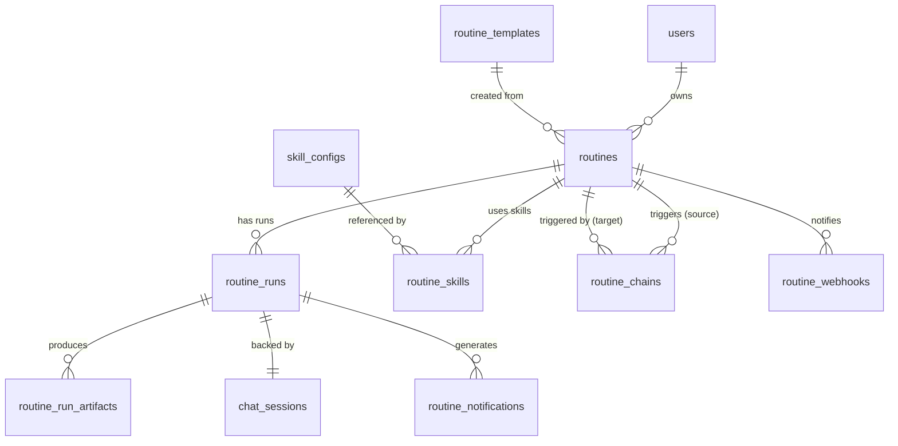
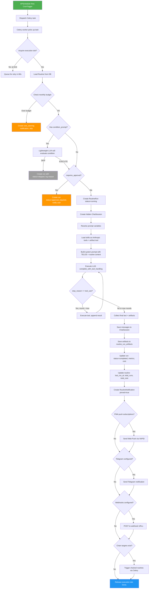
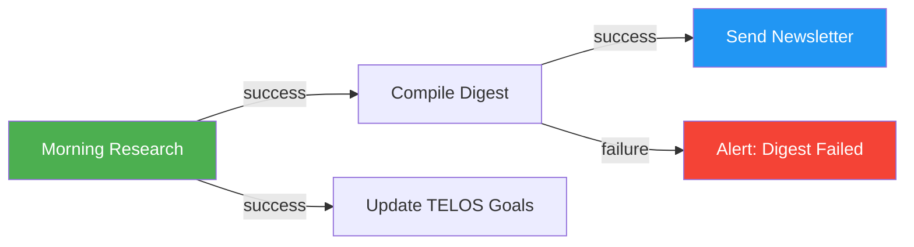
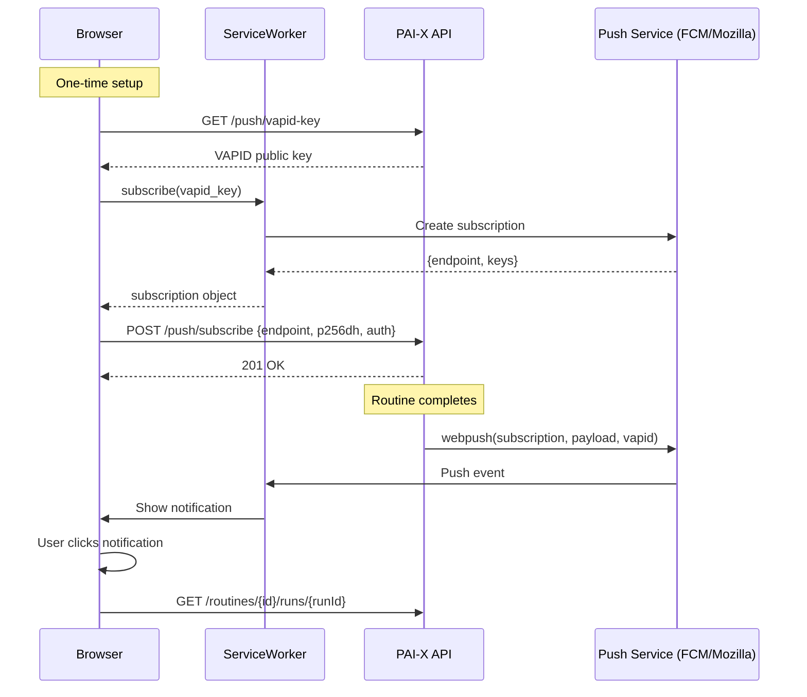
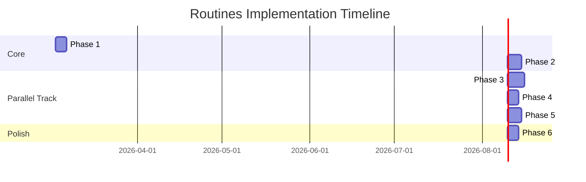

# PAI-X Routines System -- Complete Architecture

**Version:** 1.0
**Date:** 2026-03-02
**Author:** System Architect
**Status:** Blueprint for Implementation

---

## Table of Contents

1. [System Overview](#1-system-overview)
2. [Database Schema](#2-database-schema)
3. [API Endpoints](#3-api-endpoints)
4. [Service Layer](#4-service-layer)
5. [Scheduler Architecture](#5-scheduler-architecture)
6. [Execution Flow](#6-execution-flow)
7. [Routine Chaining Design](#7-routine-chaining-design)
8. [Notification System](#8-notification-system)
9. [Frontend Architecture](#9-frontend-architecture)
10. [Security Considerations](#10-security-considerations)
11. [Tech Decisions](#11-tech-decisions)
12. [Implementation Phases](#12-implementation-phases)

---

## 1. System Overview

### The Fundamental Constraint

A routine is an autonomous AI execution that runs **without a user present**. This single constraint shapes every design decision: there is no WebSocket to stream to, no user to ask clarifying questions, no interactive feedback loop. The system must execute, judge completion, persist results, and notify -- all autonomously.

This differentiates routines from every other PAI-X feature. Chat is synchronous and interactive. Reminders are passive notifications. Routines are **active autonomous agents on a schedule**.

### Architecture Position

Routines sit at the intersection of three existing PAI-X layers:

```
SCHEDULER (Action Layer)
    |
    v
ROUTINE EXECUTOR (Intelligence Layer)
    |
    +---> LLM Service (Claude API with Tool Use)
    +---> Skill Service (tools available to the routine)
    +---> Chat Service (hidden session for result persistence)
    |
    v
NOTIFICATION DISPATCH (Interface Layer)
    |
    +---> In-App (persistent pinned notifications)
    +---> PWA Push (Web Push API via VAPID)
    +---> Webhook (HTTP POST to external URL)
    +---> Telegram (existing integration)
```

### Key Design Decisions

1. **APScheduler over Celery Beat** for per-user dynamic scheduling (see Section 11)
2. **Hidden chat sessions** for result storage -- reuses existing ChatSession/ChatMessage models
3. **PostgreSQL job store** for APScheduler -- survives server restarts
4. **DAG-based chaining** with topological sort and cycle detection
5. **Celery workers** for actual execution -- APScheduler only triggers, Celery executes

---

## 2. Database Schema

### Entity Relationship Diagram



### Table: `routines`

The core routine definition. One row per user-created routine.

```python
class Routine(Base):
    """A scheduled, autonomous AI task definition."""

    __tablename__ = "routines"

    id: Mapped[uuid.UUID] = mapped_column(
        UUID(as_uuid=True), primary_key=True, default=uuid.uuid4
    )
    user_id: Mapped[uuid.UUID] = mapped_column(
        UUID(as_uuid=True),
        ForeignKey("users.id", ondelete="CASCADE"),
        nullable=False,
        index=True,
    )

    # ---- Definition ----
    name: Mapped[str] = mapped_column(String(255), nullable=False)
    description: Mapped[str | None] = mapped_column(Text, nullable=True)
    prompt: Mapped[str] = mapped_column(Text, nullable=False)
    system_prompt_override: Mapped[str | None] = mapped_column(Text, nullable=True)

    # ---- Schedule ----
    cron_expression: Mapped[str] = mapped_column(String(100), nullable=False)
    timezone: Mapped[str] = mapped_column(String(50), default="Europe/Berlin")
    is_active: Mapped[bool] = mapped_column(Boolean, default=True)

    # ---- Execution Config ----
    max_tokens: Mapped[int] = mapped_column(Integer, default=8192)
    model: Mapped[str] = mapped_column(String(50), default="claude-sonnet-4-6")
    temperature: Mapped[float] = mapped_column(Float, default=0.7)
    max_tool_rounds: Mapped[int] = mapped_column(Integer, default=3)
    timeout_seconds: Mapped[int] = mapped_column(Integer, default=300)

    # ---- Retry Config ----
    retry_on_failure: Mapped[bool] = mapped_column(Boolean, default=True)
    max_retries: Mapped[int] = mapped_column(Integer, default=2)
    retry_delay_seconds: Mapped[int] = mapped_column(Integer, default=60)

    # ---- Conditional Execution ----
    condition_prompt: Mapped[str | None] = mapped_column(Text, nullable=True)
    # If set, a lightweight LLM call evaluates this prompt first.
    # Must return "EXECUTE" or "SKIP" (with optional reason).
    # Example: "Only execute if it is a weekday"

    # ---- Approval Gate ----
    requires_approval: Mapped[bool] = mapped_column(Boolean, default=False)
    # If True, creates a pending notification instead of executing.
    # User must approve before execution proceeds.

    # ---- Cost Controls ----
    max_cost_per_run_cents: Mapped[int | None] = mapped_column(
        Integer, nullable=True
    )
    monthly_budget_cents: Mapped[int | None] = mapped_column(
        Integer, nullable=True
    )

    # ---- Metadata ----
    template_id: Mapped[uuid.UUID | None] = mapped_column(
        UUID(as_uuid=True),
        ForeignKey("routine_templates.id", ondelete="SET NULL"),
        nullable=True,
    )
    tags: Mapped[list] = mapped_column(JSONB, default=list)
    metadata_json: Mapped[dict] = mapped_column(
        "routine_metadata", JSONB, default=dict
    )

    # ---- Computed / Cached ----
    next_run_at: Mapped[datetime | None] = mapped_column(
        DateTime(timezone=True), nullable=True
    )
    last_run_at: Mapped[datetime | None] = mapped_column(
        DateTime(timezone=True), nullable=True
    )
    last_run_status: Mapped[str | None] = mapped_column(
        String(20), nullable=True
    )
    total_runs: Mapped[int] = mapped_column(Integer, default=0)
    total_cost_cents: Mapped[int] = mapped_column(Integer, default=0)

    # ---- Timestamps ----
    created_at: Mapped[datetime] = mapped_column(
        DateTime(timezone=True), server_default=func.now()
    )
    updated_at: Mapped[datetime] = mapped_column(
        DateTime(timezone=True), server_default=func.now(), onupdate=func.now()
    )

    # ---- Relationships ----
    user: Mapped["User"] = relationship("User", back_populates="routines")
    runs: Mapped[list["RoutineRun"]] = relationship(
        "RoutineRun", back_populates="routine", cascade="all, delete-orphan"
    )
    skills: Mapped[list["RoutineSkill"]] = relationship(
        "RoutineSkill", back_populates="routine", cascade="all, delete-orphan"
    )
    webhooks: Mapped[list["RoutineWebhook"]] = relationship(
        "RoutineWebhook", back_populates="routine", cascade="all, delete-orphan"
    )
    source_chains: Mapped[list["RoutineChain"]] = relationship(
        "RoutineChain",
        foreign_keys="RoutineChain.source_routine_id",
        back_populates="source_routine",
        cascade="all, delete-orphan",
    )
    target_chains: Mapped[list["RoutineChain"]] = relationship(
        "RoutineChain",
        foreign_keys="RoutineChain.target_routine_id",
        back_populates="target_routine",
    )
```

**Indexes:**

```sql
CREATE INDEX idx_routines_user_id ON routines(user_id);
CREATE INDEX idx_routines_is_active ON routines(user_id, is_active);
CREATE INDEX idx_routines_next_run ON routines(next_run_at) WHERE is_active = true;
```

### Table: `routine_skills`

Junction table: which skills (tools) a routine is allowed to use.

```python
class RoutineSkill(Base):
    """Skills (tools) available to a routine during execution."""

    __tablename__ = "routine_skills"

    id: Mapped[uuid.UUID] = mapped_column(
        UUID(as_uuid=True), primary_key=True, default=uuid.uuid4
    )
    routine_id: Mapped[uuid.UUID] = mapped_column(
        UUID(as_uuid=True),
        ForeignKey("routines.id", ondelete="CASCADE"),
        nullable=False,
    )
    skill_id: Mapped[str] = mapped_column(String(100), nullable=False)
    # The skill_id references skill_configs.skill_id for this user.

    # Relationships
    routine: Mapped["Routine"] = relationship("Routine", back_populates="skills")

    __table_args__ = (
        UniqueConstraint("routine_id", "skill_id", name="uq_routine_skill"),
    )
```

### Table: `routine_runs`

Every execution of a routine produces exactly one run record.

```python
class RoutineRun(Base):
    """A single execution of a routine."""

    __tablename__ = "routine_runs"

    id: Mapped[uuid.UUID] = mapped_column(
        UUID(as_uuid=True), primary_key=True, default=uuid.uuid4
    )
    routine_id: Mapped[uuid.UUID] = mapped_column(
        UUID(as_uuid=True),
        ForeignKey("routines.id", ondelete="CASCADE"),
        nullable=False,
        index=True,
    )
    user_id: Mapped[uuid.UUID] = mapped_column(
        UUID(as_uuid=True),
        ForeignKey("users.id", ondelete="CASCADE"),
        nullable=False,
        index=True,
    )

    # ---- Execution State ----
    status: Mapped[str] = mapped_column(
        String(20), nullable=False, default="pending"
    )
    # Status flow: pending -> condition_check -> running -> completed | failed | skipped | cancelled
    # Also: pending -> approval_required (if requires_approval)

    trigger_type: Mapped[str] = mapped_column(
        String(20), nullable=False, default="scheduled"
    )
    # "scheduled" | "manual" | "chained" | "retry"

    # ---- Linked Chat Session ----
    chat_session_id: Mapped[uuid.UUID | None] = mapped_column(
        UUID(as_uuid=True),
        ForeignKey("chat_sessions.id", ondelete="SET NULL"),
        nullable=True,
    )

    # ---- Input Context ----
    resolved_prompt: Mapped[str] = mapped_column(Text, nullable=False)
    # The prompt after variable interpolation (e.g., {{previous.result}} replaced)
    input_context: Mapped[dict | None] = mapped_column(JSONB, nullable=True)
    # Context passed from chained routine, or manual trigger payload

    # ---- Output ----
    result_text: Mapped[str | None] = mapped_column(Text, nullable=True)
    result_summary: Mapped[str | None] = mapped_column(String(500), nullable=True)
    # Auto-generated summary of the result for notification display

    # ---- Metrics ----
    started_at: Mapped[datetime | None] = mapped_column(
        DateTime(timezone=True), nullable=True
    )
    completed_at: Mapped[datetime | None] = mapped_column(
        DateTime(timezone=True), nullable=True
    )
    duration_ms: Mapped[int | None] = mapped_column(Integer, nullable=True)
    input_tokens: Mapped[int] = mapped_column(Integer, default=0)
    output_tokens: Mapped[int] = mapped_column(Integer, default=0)
    total_tokens: Mapped[int] = mapped_column(Integer, default=0)
    estimated_cost_cents: Mapped[int] = mapped_column(Integer, default=0)
    tool_calls_count: Mapped[int] = mapped_column(Integer, default=0)
    tool_rounds: Mapped[int] = mapped_column(Integer, default=0)

    # ---- Error Handling ----
    error_message: Mapped[str | None] = mapped_column(Text, nullable=True)
    error_type: Mapped[str | None] = mapped_column(String(100), nullable=True)
    retry_count: Mapped[int] = mapped_column(Integer, default=0)
    parent_run_id: Mapped[uuid.UUID | None] = mapped_column(
        UUID(as_uuid=True),
        ForeignKey("routine_runs.id", ondelete="SET NULL"),
        nullable=True,
    )
    # Set when this run is a retry of a failed parent run

    # ---- Condition Check ----
    condition_result: Mapped[str | None] = mapped_column(
        String(10), nullable=True
    )
    # "EXECUTE" | "SKIP" | NULL (no condition)
    condition_reason: Mapped[str | None] = mapped_column(Text, nullable=True)

    # ---- Timestamps ----
    created_at: Mapped[datetime] = mapped_column(
        DateTime(timezone=True), server_default=func.now()
    )

    # ---- Relationships ----
    routine: Mapped["Routine"] = relationship("Routine", back_populates="runs")
    chat_session: Mapped["ChatSession | None"] = relationship("ChatSession")
    artifacts: Mapped[list["RoutineRunArtifact"]] = relationship(
        "RoutineRunArtifact", back_populates="run", cascade="all, delete-orphan"
    )
    notifications: Mapped[list["RoutineNotification"]] = relationship(
        "RoutineNotification", back_populates="run", cascade="all, delete-orphan"
    )
```

**Indexes:**

```sql
CREATE INDEX idx_routine_runs_routine ON routine_runs(routine_id);
CREATE INDEX idx_routine_runs_user ON routine_runs(user_id);
CREATE INDEX idx_routine_runs_status ON routine_runs(status);
CREATE INDEX idx_routine_runs_created ON routine_runs(created_at DESC);
CREATE INDEX idx_routine_runs_routine_created ON routine_runs(routine_id, created_at DESC);
```

### Table: `routine_run_artifacts`

Artifacts (code, documents, diagrams) generated during a routine run.

```python
class RoutineRunArtifact(Base):
    """An artifact produced during a routine run."""

    __tablename__ = "routine_run_artifacts"

    id: Mapped[uuid.UUID] = mapped_column(
        UUID(as_uuid=True), primary_key=True, default=uuid.uuid4
    )
    run_id: Mapped[uuid.UUID] = mapped_column(
        UUID(as_uuid=True),
        ForeignKey("routine_runs.id", ondelete="CASCADE"),
        nullable=False,
        index=True,
    )
    title: Mapped[str] = mapped_column(String(255), nullable=False)
    artifact_type: Mapped[str] = mapped_column(
        String(20), nullable=False
    )
    # "code" | "markdown" | "html" | "mermaid" | "svg"
    language: Mapped[str | None] = mapped_column(String(50), nullable=True)
    content: Mapped[str] = mapped_column(Text, nullable=False)
    created_at: Mapped[datetime] = mapped_column(
        DateTime(timezone=True), server_default=func.now()
    )

    # Relationships
    run: Mapped["RoutineRun"] = relationship(
        "RoutineRun", back_populates="artifacts"
    )
```

### Table: `routine_notifications`

Persistent notifications tied to routine runs. These are distinct from the general `notifications` table because routine notifications have special behavior: they are **pinned** until explicitly dismissed by clicking through to the result.

```python
class RoutineNotification(Base):
    """A persistent notification for a routine run result."""

    __tablename__ = "routine_notifications"

    id: Mapped[uuid.UUID] = mapped_column(
        UUID(as_uuid=True), primary_key=True, default=uuid.uuid4
    )
    run_id: Mapped[uuid.UUID] = mapped_column(
        UUID(as_uuid=True),
        ForeignKey("routine_runs.id", ondelete="CASCADE"),
        nullable=False,
        index=True,
    )
    user_id: Mapped[uuid.UUID] = mapped_column(
        UUID(as_uuid=True),
        ForeignKey("users.id", ondelete="CASCADE"),
        nullable=False,
        index=True,
    )

    # ---- Content ----
    title: Mapped[str] = mapped_column(String(255), nullable=False)
    summary: Mapped[str] = mapped_column(String(500), nullable=False)
    notification_type: Mapped[str] = mapped_column(
        String(30), nullable=False, default="result"
    )
    # "result" | "approval_required" | "failure" | "cost_warning"

    # ---- State ----
    is_pinned: Mapped[bool] = mapped_column(Boolean, default=True)
    is_read: Mapped[bool] = mapped_column(Boolean, default=False)
    dismissed_at: Mapped[datetime | None] = mapped_column(
        DateTime(timezone=True), nullable=True
    )

    # ---- Delivery ----
    sent_channels: Mapped[list] = mapped_column(JSONB, default=list)
    # ["in_app", "pwa_push", "webhook", "telegram"]
    pwa_push_sent: Mapped[bool] = mapped_column(Boolean, default=False)
    webhook_sent: Mapped[bool] = mapped_column(Boolean, default=False)
    webhook_response_code: Mapped[int | None] = mapped_column(
        Integer, nullable=True
    )

    # ---- Timestamps ----
    created_at: Mapped[datetime] = mapped_column(
        DateTime(timezone=True), server_default=func.now()
    )

    # ---- Relationships ----
    run: Mapped["RoutineRun"] = relationship(
        "RoutineRun", back_populates="notifications"
    )
```

**Indexes:**

```sql
CREATE INDEX idx_routine_notif_user ON routine_notifications(user_id);
CREATE INDEX idx_routine_notif_pinned ON routine_notifications(user_id, is_pinned)
    WHERE is_pinned = true;
```

### Table: `routine_chains`

Defines directed edges in the routine chain DAG.

```python
class RoutineChain(Base):
    """A directed edge: source_routine completion triggers target_routine."""

    __tablename__ = "routine_chains"

    id: Mapped[uuid.UUID] = mapped_column(
        UUID(as_uuid=True), primary_key=True, default=uuid.uuid4
    )
    source_routine_id: Mapped[uuid.UUID] = mapped_column(
        UUID(as_uuid=True),
        ForeignKey("routines.id", ondelete="CASCADE"),
        nullable=False,
    )
    target_routine_id: Mapped[uuid.UUID] = mapped_column(
        UUID(as_uuid=True),
        ForeignKey("routines.id", ondelete="CASCADE"),
        nullable=False,
    )

    # ---- Chain Config ----
    is_active: Mapped[bool] = mapped_column(Boolean, default=True)
    execution_order: Mapped[int] = mapped_column(Integer, default=0)
    # When a source has multiple targets, execution_order determines
    # sequential order (same order = parallel, different = sequential)

    trigger_on: Mapped[str] = mapped_column(
        String(20), nullable=False, default="success"
    )
    # "success" | "failure" | "any" -- when does the chain fire?

    # ---- Data Passing ----
    pass_result: Mapped[bool] = mapped_column(Boolean, default=True)
    # If True, the source run's result_text is available as {{previous.result}}
    context_mapping: Mapped[dict | None] = mapped_column(JSONB, nullable=True)
    # Custom mapping: {"target_var": "source.field"}
    # Example: {"report_data": "previous.result", "date": "previous.started_at"}

    # ---- Condition ----
    condition_prompt: Mapped[str | None] = mapped_column(Text, nullable=True)
    # Optional additional condition evaluated before triggering target

    created_at: Mapped[datetime] = mapped_column(
        DateTime(timezone=True), server_default=func.now()
    )

    # ---- Relationships ----
    source_routine: Mapped["Routine"] = relationship(
        "Routine",
        foreign_keys=[source_routine_id],
        back_populates="source_chains",
    )
    target_routine: Mapped["Routine"] = relationship(
        "Routine",
        foreign_keys=[target_routine_id],
        back_populates="target_chains",
    )

    __table_args__ = (
        UniqueConstraint(
            "source_routine_id", "target_routine_id", name="uq_chain_edge"
        ),
        CheckConstraint(
            "source_routine_id != target_routine_id", name="ck_no_self_chain"
        ),
    )
```

**Indexes:**

```sql
CREATE INDEX idx_chains_source ON routine_chains(source_routine_id);
CREATE INDEX idx_chains_target ON routine_chains(target_routine_id);
```

### Table: `routine_webhooks`

Webhook configurations per routine.

```python
class RoutineWebhook(Base):
    """Webhook configuration for a routine."""

    __tablename__ = "routine_webhooks"

    id: Mapped[uuid.UUID] = mapped_column(
        UUID(as_uuid=True), primary_key=True, default=uuid.uuid4
    )
    routine_id: Mapped[uuid.UUID] = mapped_column(
        UUID(as_uuid=True),
        ForeignKey("routines.id", ondelete="CASCADE"),
        nullable=False,
    )

    url: Mapped[str] = mapped_column(String(2000), nullable=False)
    method: Mapped[str] = mapped_column(String(10), default="POST")
    headers: Mapped[dict] = mapped_column(JSONB, default=dict)
    # Example: {"Authorization": "Bearer {{secret}}", "Content-Type": "application/json"}

    payload_template: Mapped[str | None] = mapped_column(Text, nullable=True)
    # Jinja2-like template for the payload body.
    # Available variables: {{routine.name}}, {{run.result}}, {{run.status}}, etc.
    # If NULL, sends a default JSON payload.

    trigger_on: Mapped[str] = mapped_column(
        String(20), nullable=False, default="success"
    )
    # "success" | "failure" | "any"

    is_active: Mapped[bool] = mapped_column(Boolean, default=True)
    secret: Mapped[str | None] = mapped_column(String(500), nullable=True)
    # HMAC secret for webhook signature verification

    created_at: Mapped[datetime] = mapped_column(
        DateTime(timezone=True), server_default=func.now()
    )

    # Relationships
    routine: Mapped["Routine"] = relationship(
        "Routine", back_populates="webhooks"
    )
```

### Table: `routine_templates`

Pre-built routine templates for common use cases.

```python
class RoutineTemplate(Base):
    """A pre-built routine template."""

    __tablename__ = "routine_templates"

    id: Mapped[uuid.UUID] = mapped_column(
        UUID(as_uuid=True), primary_key=True, default=uuid.uuid4
    )

    # ---- Definition ----
    name: Mapped[str] = mapped_column(String(255), nullable=False)
    description: Mapped[str] = mapped_column(Text, nullable=False)
    category: Mapped[str] = mapped_column(String(50), nullable=False)
    # "productivity" | "content" | "analysis" | "communication" | "health"
    icon: Mapped[str] = mapped_column(String(50), default="zap")
    # Lucide icon name

    # ---- Template Content ----
    prompt_template: Mapped[str] = mapped_column(Text, nullable=False)
    system_prompt_override: Mapped[str | None] = mapped_column(
        Text, nullable=True
    )
    suggested_cron: Mapped[str] = mapped_column(String(100), nullable=False)
    suggested_skills: Mapped[list] = mapped_column(JSONB, default=list)
    # List of skill_ids that work well with this template

    # ---- Config Defaults ----
    default_model: Mapped[str] = mapped_column(
        String(50), default="claude-sonnet-4-6"
    )
    default_max_tokens: Mapped[int] = mapped_column(Integer, default=4096)

    # ---- Variables ----
    variables: Mapped[list] = mapped_column(JSONB, default=list)
    # Schema for user-customizable variables in the prompt_template.
    # Example: [{"name": "topic", "type": "string", "label": "Topic",
    #            "required": true, "placeholder": "AI news"}]

    # ---- Metadata ----
    is_featured: Mapped[bool] = mapped_column(Boolean, default=False)
    usage_count: Mapped[int] = mapped_column(Integer, default=0)
    created_at: Mapped[datetime] = mapped_column(
        DateTime(timezone=True), server_default=func.now()
    )
```

### Table: `push_subscriptions`

PWA Push notification subscriptions (Web Push API).

```python
class PushSubscription(Base):
    """Web Push API subscription for a user's browser/device."""

    __tablename__ = "push_subscriptions"

    id: Mapped[uuid.UUID] = mapped_column(
        UUID(as_uuid=True), primary_key=True, default=uuid.uuid4
    )
    user_id: Mapped[uuid.UUID] = mapped_column(
        UUID(as_uuid=True),
        ForeignKey("users.id", ondelete="CASCADE"),
        nullable=False,
        index=True,
    )
    endpoint: Mapped[str] = mapped_column(Text, nullable=False, unique=True)
    p256dh_key: Mapped[str] = mapped_column(String(500), nullable=False)
    auth_key: Mapped[str] = mapped_column(String(500), nullable=False)
    user_agent: Mapped[str | None] = mapped_column(String(500), nullable=True)
    is_active: Mapped[bool] = mapped_column(Boolean, default=True)
    created_at: Mapped[datetime] = mapped_column(
        DateTime(timezone=True), server_default=func.now()
    )
```

### Alembic Migration Summary

The following tables are added in a single migration:

```
routines
routine_skills
routine_runs
routine_run_artifacts
routine_notifications
routine_chains
routine_webhooks
routine_templates
push_subscriptions
```

User model requires a new relationship:

```python
# In models/user.py, add:
routines: Mapped[list["Routine"]] = relationship(
    "Routine", back_populates="user", cascade="all, delete-orphan"
)
```

---

## 3. API Endpoints

All endpoints are prefixed with `/api/v1` and require JWT authentication via `get_current_user` unless noted otherwise.

### 3.1 Routine CRUD

| Method | Path | Description |
|--------|------|-------------|
| `GET` | `/routines` | List all routines for the current user |
| `POST` | `/routines` | Create a new routine |
| `GET` | `/routines/{id}` | Get routine details |
| `PUT` | `/routines/{id}` | Update a routine |
| `DELETE` | `/routines/{id}` | Delete a routine |
| `PATCH` | `/routines/{id}/toggle` | Toggle active/inactive |

#### `GET /routines`

```
Query Parameters:
  - is_active: bool (optional) -- filter by active status
  - tag: string (optional) -- filter by tag
  - sort: string (optional) -- "next_run" | "last_run" | "created" | "name"
  - limit: int (default 20, max 100)
  - offset: int (default 0)

Response 200:
{
  "routines": [
    {
      "id": "uuid",
      "name": "Daily News Digest",
      "description": "...",
      "cron_expression": "0 8 * * *",
      "cron_human": "Every day at 8:00 AM",
      "timezone": "Europe/Berlin",
      "is_active": true,
      "next_run_at": "2026-03-03T08:00:00+01:00",
      "last_run_at": "2026-03-02T08:00:00+01:00",
      "last_run_status": "completed",
      "total_runs": 14,
      "total_cost_cents": 42,
      "tags": ["news", "daily"],
      "skill_count": 2,
      "chain_count": 1,
      "created_at": "..."
    }
  ],
  "total": 5,
  "limit": 20,
  "offset": 0
}
```

#### `POST /routines`

```
Request Body:
{
  "name": "Daily News Digest",
  "description": "Summarizes top AI news every morning",
  "prompt": "Research the top 5 AI news stories from today. Summarize each in 2-3 sentences. Include source URLs.",
  "cron_expression": "0 8 * * *",
  "timezone": "Europe/Berlin",
  "skill_ids": ["content_pipeline", "idea_capture"],
  "model": "claude-sonnet-4-6",
  "max_tokens": 4096,
  "temperature": 0.7,
  "max_tool_rounds": 3,
  "timeout_seconds": 300,
  "retry_on_failure": true,
  "max_retries": 2,
  "condition_prompt": null,
  "requires_approval": false,
  "max_cost_per_run_cents": 10,
  "monthly_budget_cents": 300,
  "tags": ["news", "daily"],
  "template_id": null
}

Response 201:
{
  "routine": { ... full routine object ... }
}
```

#### `PUT /routines/{id}`

Same body as POST (all fields optional). Recomputes `next_run_at` when schedule changes. Reschedules the APScheduler job.

#### `PATCH /routines/{id}/toggle`

```
Response 200:
{
  "routine": { ... },
  "message": "Routine activated" | "Routine deactivated"
}
```

### 3.2 Run Management

| Method | Path | Description |
|--------|------|-------------|
| `GET` | `/routines/{id}/runs` | List run history |
| `GET` | `/routines/{id}/runs/{runId}` | Get run details |
| `POST` | `/routines/{id}/run` | Manually trigger a run |
| `POST` | `/routines/{id}/runs/{runId}/cancel` | Cancel a running execution |
| `POST` | `/routines/{id}/runs/{runId}/retry` | Retry a failed run |
| `POST` | `/routines/{id}/runs/{runId}/approve` | Approve a pending run |

#### `GET /routines/{id}/runs`

```
Query Parameters:
  - status: string (optional) -- "completed" | "failed" | "running" | "skipped"
  - limit: int (default 20, max 100)
  - offset: int (default 0)

Response 200:
{
  "runs": [
    {
      "id": "uuid",
      "status": "completed",
      "trigger_type": "scheduled",
      "started_at": "...",
      "completed_at": "...",
      "duration_ms": 12400,
      "total_tokens": 3200,
      "estimated_cost_cents": 3,
      "tool_calls_count": 2,
      "tool_rounds": 1,
      "result_summary": "Generated 5-item AI news digest covering...",
      "error_message": null,
      "condition_result": "EXECUTE",
      "has_artifacts": true,
      "artifact_count": 1,
      "chat_session_id": "uuid",
      "created_at": "..."
    }
  ],
  "total": 14,
  "limit": 20,
  "offset": 0
}
```

#### `GET /routines/{id}/runs/{runId}`

Returns full run details including:
- All fields from the list view
- `resolved_prompt` -- the actual prompt sent to the LLM
- `result_text` -- full result content
- `input_context` -- context from chained routine (if applicable)
- `artifacts` -- list of artifacts produced
- `chat_session_id` -- link to the hidden chat session with full message history

#### `POST /routines/{id}/run`

Manual trigger. Optionally accepts context overrides.

```
Request Body (optional):
{
  "context": {
    "custom_var": "value"
  },
  "skip_condition": false
}

Response 202:
{
  "run_id": "uuid",
  "status": "pending",
  "message": "Routine execution queued"
}
```

#### `POST /routines/{id}/runs/{runId}/approve`

For routines with `requires_approval = true`.

```
Response 200:
{
  "run_id": "uuid",
  "status": "running",
  "message": "Execution approved and started"
}
```

### 3.3 Notification Management

| Method | Path | Description |
|--------|------|-------------|
| `GET` | `/routines/notifications` | List pinned routine notifications |
| `PUT` | `/routines/notifications/{id}/dismiss` | Dismiss (unpin) a notification |
| `POST` | `/routines/notifications/dismiss-all` | Dismiss all |
| `GET` | `/routines/notifications/count` | Get unread/pinned count |

#### `GET /routines/notifications`

```
Query Parameters:
  - pinned_only: bool (default true)
  - limit: int (default 20)

Response 200:
{
  "notifications": [
    {
      "id": "uuid",
      "run_id": "uuid",
      "routine_id": "uuid",
      "routine_name": "Daily News Digest",
      "title": "News Digest completed",
      "summary": "5 AI stories summarized...",
      "notification_type": "result",
      "is_pinned": true,
      "is_read": false,
      "created_at": "..."
    }
  ],
  "pinned_count": 3,
  "total": 3
}
```

#### `GET /routines/notifications/count`

```
Response 200:
{
  "pinned": 3,
  "unread": 5
}
```

This endpoint is polled by the frontend header notification bell (every 30s or via SSE).

### 3.4 Chain Management

| Method | Path | Description |
|--------|------|-------------|
| `GET` | `/routines/{id}/chains` | List chains for a routine |
| `POST` | `/routines/{id}/chains` | Add a chain link |
| `DELETE` | `/routines/chains/{chainId}` | Remove a chain link |
| `GET` | `/routines/chains/graph` | Get the full chain DAG for the user |
| `POST` | `/routines/chains/validate` | Validate a proposed chain (cycle detection) |

#### `POST /routines/{id}/chains`

```
Request Body:
{
  "target_routine_id": "uuid",
  "trigger_on": "success",
  "pass_result": true,
  "context_mapping": null,
  "execution_order": 0
}

Response 201 (if valid):
{
  "chain": { ... }
}

Response 409 (if cycle detected):
{
  "error": "Adding this chain would create a cycle: A -> B -> C -> A",
  "cycle_path": ["routine-A-id", "routine-B-id", "routine-C-id", "routine-A-id"]
}
```

#### `GET /routines/chains/graph`

Returns the full DAG for visualization in the chain builder UI.

```
Response 200:
{
  "nodes": [
    {"id": "uuid", "name": "Daily Digest", "is_active": true},
    {"id": "uuid", "name": "Send Newsletter", "is_active": true}
  ],
  "edges": [
    {
      "id": "chain-uuid",
      "source": "routine-uuid-1",
      "target": "routine-uuid-2",
      "trigger_on": "success",
      "is_active": true
    }
  ]
}
```

### 3.5 Template Management

| Method | Path | Description |
|--------|------|-------------|
| `GET` | `/routines/templates` | List available templates |
| `GET` | `/routines/templates/{id}` | Get template details |
| `POST` | `/routines/from-template/{id}` | Create routine from template |

#### `GET /routines/templates`

```
Query Parameters:
  - category: string (optional)
  - featured: bool (optional)

Response 200:
{
  "templates": [
    {
      "id": "uuid",
      "name": "Daily News Digest",
      "description": "Get a summary of top news in any topic every morning",
      "category": "content",
      "icon": "newspaper",
      "suggested_cron": "0 8 * * *",
      "variables": [
        {"name": "topic", "type": "string", "label": "Topic", "required": true}
      ],
      "is_featured": true,
      "usage_count": 42
    }
  ]
}
```

#### `POST /routines/from-template/{id}`

```
Request Body:
{
  "name": "My AI News Digest",
  "variables": {
    "topic": "artificial intelligence"
  },
  "cron_expression": "0 8 * * MON-FRI",
  "timezone": "Europe/Berlin"
}

Response 201:
{
  "routine": { ... }
}
```

### 3.6 Webhook Management

| Method | Path | Description |
|--------|------|-------------|
| `GET` | `/routines/{id}/webhooks` | List webhooks for a routine |
| `POST` | `/routines/{id}/webhooks` | Add a webhook |
| `PUT` | `/routines/webhooks/{webhookId}` | Update a webhook |
| `DELETE` | `/routines/webhooks/{webhookId}` | Delete a webhook |
| `POST` | `/routines/webhooks/{webhookId}/test` | Send test webhook |

### 3.7 AI-Assisted Creation

| Method | Path | Description |
|--------|------|-------------|
| `POST` | `/routines/ai/suggest` | AI suggests a routine from natural language |
| `POST` | `/routines/ai/refine-prompt` | AI refines/improves a routine prompt |
| `POST` | `/routines/ai/cron-from-text` | Convert natural language schedule to cron |

#### `POST /routines/ai/suggest`

```
Request Body:
{
  "description": "Every morning, check my calendar and prepare a briefing for today's meetings"
}

Response 200:
{
  "suggestion": {
    "name": "Morning Meeting Briefing",
    "prompt": "Look at today's calendar. For each meeting, ...",
    "cron_expression": "0 7 * * MON-FRI",
    "cron_human": "Every weekday at 7:00 AM",
    "suggested_skills": ["calendar_briefing", "meeting_prep"],
    "explanation": "This routine will run every weekday morning..."
  }
}
```

### 3.8 PWA Push Subscription

| Method | Path | Description |
|--------|------|-------------|
| `POST` | `/push/subscribe` | Register a push subscription |
| `DELETE` | `/push/subscribe` | Unregister a push subscription |
| `GET` | `/push/vapid-key` | Get the VAPID public key |

---

## 4. Service Layer

### 4.1 RoutineService

Location: `api/services/routine_service.py`

Handles CRUD operations with validation.

```python
class RoutineService:
    """CRUD and business logic for routines."""

    async def create_routine(
        self, db: AsyncSession, user_id: uuid.UUID, data: RoutineCreateSchema
    ) -> Routine:
        """
        Create a routine:
        1. Validate cron expression (via croniter.is_valid)
        2. Validate skill_ids exist for this user
        3. Create routine row
        4. Create routine_skills rows
        5. Compute next_run_at
        6. Register with scheduler
        """
        ...

    async def update_routine(
        self, db: AsyncSession, routine_id: uuid.UUID, user_id: uuid.UUID,
        data: RoutineUpdateSchema
    ) -> Routine:
        """
        Update routine. If cron_expression or timezone changed:
        1. Recompute next_run_at
        2. Reschedule APScheduler job
        """
        ...

    async def delete_routine(
        self, db: AsyncSession, routine_id: uuid.UUID, user_id: uuid.UUID
    ) -> None:
        """
        Delete routine:
        1. Remove APScheduler job
        2. Remove chain edges (cascade handles this)
        3. Delete routine (cascade deletes runs, notifications, etc.)
        """
        ...

    async def toggle_routine(
        self, db: AsyncSession, routine_id: uuid.UUID, user_id: uuid.UUID
    ) -> Routine:
        """Toggle is_active. Add/remove APScheduler job accordingly."""
        ...

    async def get_routine_with_stats(
        self, db: AsyncSession, routine_id: uuid.UUID, user_id: uuid.UUID
    ) -> dict:
        """Get routine with computed stats (avg duration, success rate, cost)."""
        ...

    def compute_next_run(
        self, cron_expression: str, timezone: str, after: datetime | None = None
    ) -> datetime:
        """Compute the next run time using croniter with timezone support."""
        from croniter import croniter
        from zoneinfo import ZoneInfo

        tz = ZoneInfo(timezone)
        base = after or datetime.now(tz)
        cron = croniter(cron_expression, base)
        return cron.get_next(datetime)

    async def check_monthly_budget(
        self, db: AsyncSession, routine: Routine
    ) -> bool:
        """Check if the routine has remaining monthly budget. Returns True if OK."""
        ...

    async def validate_skill_ids(
        self, db: AsyncSession, user_id: uuid.UUID, skill_ids: list[str]
    ) -> list[str]:
        """Validate that all skill_ids exist and are active for this user.
        Returns list of invalid skill_ids (empty if all valid)."""
        ...
```

### 4.2 RoutineSchedulerService

Location: `api/services/routine_scheduler_service.py`

Manages the APScheduler integration for dynamic per-user scheduling.

```python
class RoutineSchedulerService:
    """Manages APScheduler jobs for routine scheduling."""

    def __init__(self):
        self.scheduler: AsyncIOScheduler | None = None

    def init_scheduler(self, scheduler: AsyncIOScheduler) -> None:
        """Called once during app startup. Receives the shared scheduler."""
        self.scheduler = scheduler

    async def load_all_jobs(self, db: AsyncSession) -> int:
        """
        On startup: load all active routines from DB and register
        APScheduler jobs. Returns count of jobs loaded.
        """
        ...

    def schedule_routine(self, routine: Routine) -> None:
        """
        Add or replace an APScheduler CronTrigger job for this routine.
        The job calls _trigger_routine_execution(routine_id).
        """
        from apscheduler.triggers.cron import CronTrigger

        trigger = CronTrigger.from_crontab(
            routine.cron_expression,
            timezone=routine.timezone,
        )
        self.scheduler.add_job(
            _trigger_routine_execution,
            trigger=trigger,
            id=f"routine_{routine.id}",
            replace_existing=True,
            args=[str(routine.id)],
            misfire_grace_time=300,  # 5 minute grace period
        )

    def unschedule_routine(self, routine_id: uuid.UUID) -> None:
        """Remove the APScheduler job for this routine."""
        job_id = f"routine_{routine_id}"
        if self.scheduler.get_job(job_id):
            self.scheduler.remove_job(job_id)

    def get_job_info(self, routine_id: uuid.UUID) -> dict | None:
        """Get APScheduler job info (next run, etc.)."""
        ...


async def _trigger_routine_execution(routine_id: str) -> None:
    """
    APScheduler callback. This function:
    1. Dispatches a Celery task for the actual execution
    2. This separation ensures APScheduler stays lightweight
       (it only triggers, never executes long-running LLM calls)
    """
    from celery_app import celery
    celery.send_task(
        "tasks.routines.execute_routine",
        args=[routine_id],
        queue="routines",
    )
```

### 4.3 RoutineExecutorService

Location: `api/services/routine_executor_service.py`

The core execution engine. This is the most complex service.

```python
class RoutineExecutorService:
    """Executes routines autonomously: LLM call with tools, no user interaction."""

    async def execute(
        self,
        routine_id: uuid.UUID,
        trigger_type: str = "scheduled",
        input_context: dict | None = None,
        parent_run_id: uuid.UUID | None = None,
    ) -> RoutineRun:
        """
        Full execution pipeline:
        1. Load routine from DB
        2. Check monthly budget
        3. Evaluate condition (if set)
        4. Check approval gate (if set)
        5. Create hidden chat session
        6. Resolve prompt variables
        7. Load selected skills as Anthropic tools
        8. Build system prompt
        9. Execute LLM call with tool handling
        10. Extract artifacts
        11. Save results (run + messages + artifacts)
        12. Create notification
        13. Trigger webhooks
        14. Trigger chained routines
        15. Update routine stats
        16. Return run record
        """
        ...

    async def _evaluate_condition(
        self, routine: Routine, context: dict | None
    ) -> tuple[str, str | None]:
        """
        Lightweight LLM call to evaluate the condition_prompt.
        Returns (result: "EXECUTE"|"SKIP", reason: str|None).
        Uses a small, fast model call with low max_tokens.
        """
        ...

    async def _resolve_prompt(
        self, prompt: str, context: dict | None
    ) -> str:
        """
        Replace template variables in the prompt:
        - {{previous.result}} -- result from chained source
        - {{previous.started_at}} -- timestamp of source run
        - {{date}} -- current date
        - {{time}} -- current time
        - {{day_of_week}} -- current day name
        - {{context.KEY}} -- custom context values
        """
        ...

    async def _build_routine_system_prompt(
        self, routine: Routine, user: User
    ) -> str:
        """
        Build system prompt for autonomous execution:
        - Base: "You are PAI-X executing a scheduled routine autonomously."
        - Instruction: "Complete the task thoroughly. Do not ask questions."
        - User context: TELOS data (goals, projects)
        - Routine override: routine.system_prompt_override (if set)
        """
        ...

    async def _load_tools(
        self, db: AsyncSession, routine: Routine
    ) -> tuple[list[dict], Any]:
        """
        Load only the skills selected for this routine (from routine_skills).
        Always include the create_artifact tool.
        Returns (tools_list, tool_executor_fn).
        """
        ...

    async def _execute_llm(
        self,
        messages: list[dict],
        system_prompt: str,
        routine: Routine,
        tools: list[dict],
        tool_executor: Any,
        api_key: str | None,
    ) -> tuple[str, list[dict], dict]:
        """
        Run the LLM with tool use handling.
        Returns (result_text, artifacts_collected, usage_metrics).
        Uses complete_with_tool_handling from llm_service.
        """
        ...

    async def _calculate_cost(
        self, model: str, input_tokens: int, output_tokens: int
    ) -> int:
        """
        Calculate cost in cents based on model pricing.
        Returns estimated cost in cents (integer).
        """
        PRICING = {
            "claude-sonnet-4-6": {"input": 3.0, "output": 15.0},  # per 1M tokens
            "claude-haiku-3-5": {"input": 0.25, "output": 1.25},
        }
        ...

    async def cancel_run(
        self, db: AsyncSession, run_id: uuid.UUID, user_id: uuid.UUID
    ) -> RoutineRun:
        """Cancel a running or pending execution."""
        ...

    async def retry_run(
        self, db: AsyncSession, run_id: uuid.UUID, user_id: uuid.UUID
    ) -> RoutineRun:
        """Create a retry run for a failed run."""
        ...


# Singleton
routine_executor = RoutineExecutorService()
```

### 4.4 RoutineNotificationService

Location: `api/services/routine_notification_service.py`

```python
class RoutineNotificationService:
    """Handles all notification channels for routine results."""

    async def notify_result(
        self, db: AsyncSession, run: RoutineRun, routine: Routine
    ) -> RoutineNotification:
        """
        Create notification for a completed run:
        1. Generate summary (first 200 chars of result or LLM summarization)
        2. Create RoutineNotification row (pinned, unread)
        3. Send PWA Push (if subscribed)
        4. Send Telegram (if configured)
        5. Return notification record
        """
        ...

    async def notify_failure(
        self, db: AsyncSession, run: RoutineRun, routine: Routine
    ) -> RoutineNotification:
        """Create notification for a failed run."""
        ...

    async def notify_approval_required(
        self, db: AsyncSession, run: RoutineRun, routine: Routine
    ) -> RoutineNotification:
        """Create notification requesting user approval."""
        ...

    async def notify_cost_warning(
        self, db: AsyncSession, routine: Routine, current_cost: int
    ) -> RoutineNotification:
        """Notify when monthly cost approaches budget limit (80% threshold)."""
        ...

    async def send_pwa_push(
        self, db: AsyncSession, user_id: uuid.UUID, title: str, body: str,
        url: str
    ) -> bool:
        """
        Send Web Push notification via VAPID.
        Loads all active PushSubscription rows for the user.
        Returns True if at least one subscription received successfully.
        """
        from pywebpush import webpush, WebPushException
        ...

    async def dismiss_notification(
        self, db: AsyncSession, notification_id: uuid.UUID, user_id: uuid.UUID
    ) -> None:
        """Unpin and mark as read."""
        ...
```

### 4.5 RoutineChainService

Location: `api/services/routine_chain_service.py`

```python
class RoutineChainService:
    """Manages routine chaining: DAG resolution, cycle detection, triggering."""

    async def add_chain(
        self, db: AsyncSession, source_id: uuid.UUID,
        target_id: uuid.UUID, user_id: uuid.UUID, data: ChainCreateSchema
    ) -> RoutineChain:
        """
        Add a chain edge. Before adding:
        1. Validate both routines belong to the user
        2. Check for circular dependencies
        3. Create the chain record
        """
        ...

    async def detect_cycle(
        self, db: AsyncSession, user_id: uuid.UUID,
        proposed_source: uuid.UUID, proposed_target: uuid.UUID
    ) -> list[uuid.UUID] | None:
        """
        DFS-based cycle detection on the chain DAG.
        Returns the cycle path if adding the proposed edge would create one.
        Returns None if no cycle.

        Algorithm:
        1. Load all chain edges for this user
        2. Build adjacency list
        3. Add proposed edge temporarily
        4. Run DFS from proposed_target looking for proposed_source
        5. If found, trace and return the cycle path
        """
        ...

    async def get_chain_dag(
        self, db: AsyncSession, user_id: uuid.UUID
    ) -> dict:
        """
        Return the full DAG as {nodes: [...], edges: [...]}
        for frontend visualization.
        """
        ...

    async def trigger_chained_routines(
        self, db: AsyncSession, completed_run: RoutineRun
    ) -> list[uuid.UUID]:
        """
        After a routine run completes:
        1. Load all active chains where source_routine_id = completed_run.routine_id
        2. Filter by trigger_on matching the run status
        3. Group by execution_order
        4. For same execution_order: trigger in parallel
        5. For different execution_order: trigger sequentially
        6. Pass result context (if pass_result=True)
        7. Return list of triggered run IDs
        """
        ...

    async def _build_chain_context(
        self, chain: RoutineChain, source_run: RoutineRun
    ) -> dict:
        """
        Build the input_context for the target routine:
        {
            "previous": {
                "result": source_run.result_text,
                "summary": source_run.result_summary,
                "status": source_run.status,
                "started_at": source_run.started_at.isoformat(),
                "routine_name": source_run.routine.name,
                "run_id": str(source_run.id),
            },
            ...context_mapping applied...
        }
        """
        ...

    async def topological_sort(
        self, db: AsyncSession, user_id: uuid.UUID
    ) -> list[uuid.UUID]:
        """
        Topological sort of the chain DAG.
        Used for visualization and validation.
        """
        ...
```

### 4.6 RoutineWebhookService

Location: `api/services/routine_webhook_service.py`

```python
class RoutineWebhookService:
    """Delivers webhook notifications after routine execution."""

    async def deliver_webhooks(
        self, db: AsyncSession, run: RoutineRun, routine: Routine
    ) -> list[dict]:
        """
        For all active webhooks on this routine where trigger_on matches:
        1. Render payload from template (or use default)
        2. Compute HMAC signature (if secret is set)
        3. POST to URL with configured headers
        4. Record response code on the notification
        5. Retry once on timeout (5s) or 5xx
        6. Return delivery results
        """
        ...

    def _render_payload(
        self, template: str | None, routine: Routine, run: RoutineRun
    ) -> str:
        """
        Render the webhook payload.
        Default payload (when template is None):
        {
            "event": "routine.completed",
            "routine": {"id": "...", "name": "..."},
            "run": {
                "id": "...", "status": "...", "result_summary": "...",
                "duration_ms": ..., "completed_at": "..."
            }
        }
        """
        ...

    def _sign_payload(self, payload: str, secret: str) -> str:
        """Generate HMAC-SHA256 signature for the payload."""
        import hmac, hashlib
        return hmac.new(
            secret.encode(), payload.encode(), hashlib.sha256
        ).hexdigest()
```

---

## 5. Scheduler Architecture

### Overview

```
                     +-----------------------+
                     |    FastAPI Lifespan    |
                     |  (startup / shutdown)  |
                     +-----------+-----------+
                                 |
                     +-----------v-----------+
                     |   AsyncIOScheduler    |
                     |   (APScheduler)       |
                     |                       |
                     |  Job Store:           |
                     |  PostgreSQL           |
                     |  (apscheduler_jobs)   |
                     |                       |
                     |  Jobs:                |
                     |  - routine_{uuid}     |
                     |  - check_reminders    |
                     |  - cleanup_old_runs   |
                     +-----------+-----------+
                                 |
                      Job fires  |
                                 v
                     +-----------+-----------+
                     |  Celery Task Dispatch |
                     |  (Redis broker)       |
                     +-----------+-----------+
                                 |
                     +-----------v-----------+
                     |  Celery Worker        |
                     |  (routines queue)     |
                     |                       |
                     |  execute_routine()    |
                     |  -> RoutineExecutor   |
                     +-----------------------+
```

### APScheduler Integration with FastAPI

The existing `scheduler_service.py` already uses `AsyncIOScheduler`. We extend it.

```python
# In services/scheduler_service.py (modified)

from apscheduler.schedulers.asyncio import AsyncIOScheduler
from apscheduler.jobstores.sqlalchemy import SQLAlchemyJobStore
from apscheduler.triggers.interval import IntervalTrigger

from config import settings

# Use PostgreSQL for job persistence (survives restarts)
jobstores = {
    "default": SQLAlchemyJobStore(
        url=settings.database_url.replace("+asyncpg", ""),
        # SQLAlchemyJobStore needs synchronous URL
        tablename="apscheduler_jobs",
    ),
}

executors = {
    "default": {"type": "asyncio"},
}

job_defaults = {
    "coalesce": True,       # If multiple misfired, run only once
    "max_instances": 1,     # One instance per job at a time
    "misfire_grace_time": 300,  # 5 minute grace
}

scheduler = AsyncIOScheduler(
    jobstores=jobstores,
    executors=executors,
    job_defaults=job_defaults,
    timezone="UTC",
)
```

### Startup Sequence

```python
# In main.py lifespan:

@asynccontextmanager
async def lifespan(app: FastAPI):
    await init_db()

    # Initialize scheduler with PostgreSQL job store
    start_scheduler()

    # Load all active routines into APScheduler
    async with async_session() as db:
        count = await routine_scheduler_service.load_all_jobs(db)
        logger.info(f"Loaded {count} routine jobs into scheduler")

    yield

    stop_scheduler()
    await close_db()
```

### Timezone Handling

All times stored in UTC in the database. APScheduler CronTrigger accepts timezone parameter.

```python
from zoneinfo import ZoneInfo  # Python 3.9+ stdlib, no pytz needed

trigger = CronTrigger.from_crontab(
    "0 8 * * *",
    timezone=ZoneInfo("Europe/Berlin"),
)
# This correctly fires at 08:00 Berlin time (07:00 UTC in winter, 06:00 UTC in summer)
```

### Concurrency Control

```python
# In config.py, add:
max_concurrent_routines_per_user: int = Field(
    default=3, alias="MAX_CONCURRENT_ROUTINES"
)
max_concurrent_routines_global: int = Field(
    default=10, alias="MAX_CONCURRENT_ROUTINES_GLOBAL"
)
```

Enforcement via Redis semaphore:

```python
async def _acquire_execution_slot(user_id: uuid.UUID) -> bool:
    """Try to acquire an execution slot. Returns False if at limit."""
    import redis.asyncio as aioredis

    r = aioredis.from_url(settings.redis_url)
    key = f"routine_slots:{user_id}"
    current = await r.incr(key)
    if current == 1:
        await r.expire(key, 600)  # 10 min TTL safety net
    if current > settings.max_concurrent_routines_per_user:
        await r.decr(key)
        return False
    return True


async def _release_execution_slot(user_id: uuid.UUID) -> None:
    """Release an execution slot."""
    import redis.asyncio as aioredis

    r = aioredis.from_url(settings.redis_url)
    key = f"routine_slots:{user_id}"
    await r.decr(key)
```

### Failure Recovery

**Server Restart During Execution:**

1. APScheduler jobs are persisted in PostgreSQL (`apscheduler_jobs` table)
2. On restart, APScheduler reloads all jobs and applies `misfire_grace_time`
3. Misfired jobs (within 5 min) are coalesced and fired once
4. A startup recovery task checks for "zombie" runs:

```python
async def recover_zombie_runs(db: AsyncSession) -> int:
    """
    Find runs stuck in 'running' status (likely from a crash).
    If started_at is older than timeout_seconds, mark as failed.
    """
    cutoff = datetime.now(timezone.utc) - timedelta(minutes=15)
    result = await db.execute(
        select(RoutineRun).where(
            RoutineRun.status == "running",
            RoutineRun.started_at < cutoff,
        )
    )
    zombies = list(result.scalars().all())
    for run in zombies:
        run.status = "failed"
        run.error_message = "Execution interrupted by server restart"
        run.error_type = "server_restart"
        run.completed_at = datetime.now(timezone.utc)
        db.add(run)
    await db.flush()
    return len(zombies)
```

---

## 6. Execution Flow

### Complete Step-by-Step Flow



### Celery Task Definition

```python
# In tasks/routines.py

import asyncio
from celery_app import celery


def _run_async(coro):
    loop = asyncio.new_event_loop()
    try:
        return loop.run_until_complete(coro)
    finally:
        loop.close()


@celery.task(
    name="tasks.routines.execute_routine",
    bind=True,
    max_retries=2,
    default_retry_delay=60,
    soft_time_limit=300,
    time_limit=360,
    queue="routines",
)
def execute_routine(self, routine_id: str, trigger_type: str = "scheduled",
                    input_context: dict | None = None,
                    parent_run_id: str | None = None):
    """
    Celery task that wraps RoutineExecutorService.execute().
    """
    _run_async(_execute_routine_async(
        routine_id, trigger_type, input_context, parent_run_id
    ))


async def _execute_routine_async(
    routine_id: str, trigger_type: str,
    input_context: dict | None, parent_run_id: str | None
):
    from uuid import UUID
    from models.database import async_session
    from services.routine_executor_service import routine_executor

    async with async_session() as db:
        await routine_executor.execute(
            routine_id=UUID(routine_id),
            trigger_type=trigger_type,
            input_context=input_context,
            parent_run_id=UUID(parent_run_id) if parent_run_id else None,
        )
```

### Hidden Chat Session Pattern

Routines create a special chat session to store the LLM conversation. This reuses the existing ChatSession and ChatMessage models.

```python
# In RoutineExecutorService._create_hidden_session:

session = ChatSession(
    user_id=routine.user_id,
    title=f"[Routine] {routine.name} - {datetime.now().strftime('%Y-%m-%d %H:%M')}",
    last_message_at=datetime.now(timezone.utc),
    message_count=0,
)
db.add(session)
await db.flush()
```

The chat session is linked from `routine_runs.chat_session_id`. Users can view the full conversation in the run detail view, which reuses the existing chat message rendering components.

### Artifact Handling in Autonomous Mode

During routine execution, the `create_artifact` tool works exactly as it does in interactive chat, except no WebSocket events are emitted. Instead:

```python
# Tool executor for routines:
artifacts_collected = []

async def _routine_tool_executor(tool_name: str, tool_input: dict) -> str:
    if tool_name == "create_artifact":
        artifacts_collected.append({
            "title": tool_input.get("title", "Artifact"),
            "artifact_type": tool_input.get("artifact_type", "markdown"),
            "language": tool_input.get("language"),
            "content": tool_input.get("content", ""),
        })
        return "Artifact created and saved."
    # Delegate to skill service for other tools
    return await skill_service.execute_tool_call(
        db=db, user_id=routine.user_id,
        tool_name=tool_name, tool_input=tool_input,
    )
```

After execution, `artifacts_collected` is persisted as `RoutineRunArtifact` rows.

---

## 7. Routine Chaining Design

### DAG Structure

Routines form a Directed Acyclic Graph (DAG) per user. Each edge is a `routine_chains` row.



### Cycle Detection Algorithm

```python
async def detect_cycle(
    self, db: AsyncSession, user_id: uuid.UUID,
    proposed_source: uuid.UUID, proposed_target: uuid.UUID
) -> list[uuid.UUID] | None:
    """
    DFS-based cycle detection.
    Returns cycle path if adding edge would create cycle, else None.
    """
    # Load all edges for this user
    result = await db.execute(
        select(RoutineChain).join(
            Routine, RoutineChain.source_routine_id == Routine.id
        ).where(Routine.user_id == user_id)
    )
    edges = list(result.scalars().all())

    # Build adjacency list
    adj: dict[uuid.UUID, list[uuid.UUID]] = {}
    for edge in edges:
        adj.setdefault(edge.source_routine_id, []).append(edge.target_routine_id)

    # Add proposed edge temporarily
    adj.setdefault(proposed_source, []).append(proposed_target)

    # DFS from proposed_target to see if we can reach proposed_source
    visited = set()
    path = []

    def dfs(node: uuid.UUID) -> bool:
        if node == proposed_source:
            path.append(node)
            return True
        if node in visited:
            return False
        visited.add(node)
        path.append(node)
        for neighbor in adj.get(node, []):
            if dfs(neighbor):
                return True
        path.pop()
        return False

    if dfs(proposed_target):
        # path contains: [proposed_target, ..., proposed_source]
        # Prepend proposed_source to show the full cycle
        return [proposed_source] + path
    return None
```

### Data Passing Between Routines

The `{{previous.result}}` template variable system:

```python
VARIABLE_PATTERN = re.compile(r"\{\{(\w+(?:\.\w+)*)\}\}")

async def _resolve_prompt(self, prompt: str, context: dict | None) -> str:
    """
    Replace template variables:
    - {{previous.result}} -> context["previous"]["result"]
    - {{previous.summary}} -> context["previous"]["summary"]
    - {{date}} -> "2026-03-02"
    - {{time}} -> "08:00"
    - {{day_of_week}} -> "Monday"
    - {{context.KEY}} -> context["KEY"]
    """
    now = datetime.now(ZoneInfo("Europe/Berlin"))
    builtins = {
        "date": now.strftime("%Y-%m-%d"),
        "time": now.strftime("%H:%M"),
        "day_of_week": now.strftime("%A"),
        "datetime": now.isoformat(),
    }

    def replace_var(match: re.Match) -> str:
        var_path = match.group(1).split(".")
        # Check builtins first
        if len(var_path) == 1 and var_path[0] in builtins:
            return builtins[var_path[0]]
        # Walk the context dict
        if context:
            value = context
            for key in var_path:
                if isinstance(value, dict) and key in value:
                    value = value[key]
                else:
                    return match.group(0)  # Leave unresolved
            return str(value)
        return match.group(0)

    return VARIABLE_PATTERN.sub(replace_var, prompt)
```

### Error Propagation in Chains

```
Source routine completes:
  |
  +-- status == "completed" AND chain.trigger_on == "success"
  |     -> Trigger target with source result as context
  |
  +-- status == "failed" AND chain.trigger_on == "failure"
  |     -> Trigger target (e.g., error handler routine)
  |
  +-- status == "failed" AND chain.trigger_on == "success"
  |     -> Do NOT trigger target. Chain stops.
  |
  +-- status == any AND chain.trigger_on == "any"
        -> Always trigger target regardless of status
```

### Parallel vs Sequential Chains

Multiple targets from the same source can execute in parallel or sequentially based on `execution_order`:

```
execution_order = 0: [Routine B, Routine C]  -- parallel
execution_order = 1: [Routine D]             -- waits for order 0 to complete
```

Implementation:

```python
async def trigger_chained_routines(
    self, db: AsyncSession, completed_run: RoutineRun
) -> list[uuid.UUID]:
    chains = await self._get_active_chains(db, completed_run.routine_id)

    # Filter by trigger_on condition
    matching = [c for c in chains if self._should_trigger(c, completed_run.status)]

    # Group by execution_order
    groups: dict[int, list[RoutineChain]] = {}
    for chain in matching:
        groups.setdefault(chain.execution_order, []).append(chain)

    triggered_run_ids = []
    for order in sorted(groups.keys()):
        group = groups[order]
        # Build context for each
        tasks = []
        for chain in group:
            context = await self._build_chain_context(chain, completed_run)
            tasks.append(
                celery.send_task(
                    "tasks.routines.execute_routine",
                    args=[str(chain.target_routine_id)],
                    kwargs={
                        "trigger_type": "chained",
                        "input_context": context,
                    },
                    queue="routines",
                )
            )
            triggered_run_ids.append(chain.target_routine_id)

        # For sequential ordering, we would need to await completion.
        # Since Celery tasks are fire-and-forget, sequential chains
        # are implemented via chained Celery tasks:
        # For now, all chains in a group are dispatched simultaneously.
        # True sequential ordering (wait for group N before starting N+1)
        # requires Celery chord or callback patterns.

    return triggered_run_ids
```

---

## 8. Notification System

### In-App Notifications (Pinned)

Routine notifications differ from regular notifications:

1. They are **pinned** by default (cannot be dismissed without clicking through)
2. They link to the run result view
3. They appear in a dedicated section of the notification bell
4. They persist until explicitly dismissed

```
Header Notification Bell
|
+-- Pinned Routine Results (section)
|   |-- "Daily Digest completed" (pinned, unread)
|   |-- "Weekly Report ready" (pinned, read)
|
+-- Regular Notifications (section)
    |-- "Reminder: Team meeting at 14:00"
    |-- "Follow-up needed: Benjamin"
```

### PWA Web Push Architecture



**VAPID Key Management:**

```python
# In config.py, add:
vapid_private_key: str = Field(default="", alias="VAPID_PRIVATE_KEY")
vapid_public_key: str = Field(default="", alias="VAPID_PUBLIC_KEY")
vapid_claims_email: str = Field(default="mailto:admin@pai-x.app", alias="VAPID_EMAIL")
```

Generate keys once:

```bash
# One-time setup
python -c "from py_vapid import Vapid; v = Vapid(); v.generate_keys(); print('Private:', v.private_pem()); print('Public:', v.public_key)"
```

**Service Worker (frontend):**

```typescript
// web/public/sw.js
self.addEventListener('push', (event) => {
  const data = event.data?.json() ?? {};
  const options = {
    body: data.body || 'Routine completed',
    icon: '/icons/icon-192x192.png',
    badge: '/icons/badge-72x72.png',
    tag: data.tag || 'routine-result',
    data: { url: data.url || '/routines' },
    requireInteraction: true,  // Keep visible until user interacts
    actions: [
      { action: 'view', title: 'View Result' },
      { action: 'dismiss', title: 'Dismiss' },
    ],
  };
  event.waitUntil(
    self.registration.showNotification(data.title || 'PAI-X Routine', options)
  );
});

self.addEventListener('notificationclick', (event) => {
  event.notification.close();
  const url = event.notification.data?.url || '/routines';
  event.waitUntil(clients.openWindow(url));
});
```

### Webhook Delivery

Default webhook payload:

```json
{
  "event": "routine.completed",
  "timestamp": "2026-03-02T08:05:23Z",
  "routine": {
    "id": "uuid",
    "name": "Daily News Digest"
  },
  "run": {
    "id": "uuid",
    "status": "completed",
    "trigger_type": "scheduled",
    "result_summary": "Generated 5-item AI news digest...",
    "duration_ms": 12400,
    "total_tokens": 3200,
    "estimated_cost_cents": 3,
    "started_at": "2026-03-02T08:05:00Z",
    "completed_at": "2026-03-02T08:05:23Z"
  },
  "signature": "hmac-sha256=abc123..."
}
```

Headers sent with every webhook:

```
Content-Type: application/json
X-PAI-Event: routine.completed
X-PAI-Signature: hmac-sha256=abc123...
X-PAI-Timestamp: 2026-03-02T08:05:23Z
X-PAI-Delivery-ID: uuid
```

### Telegram Integration

Reuses existing `telegram_service.py`. Sends a formatted message:

```
PAI-X Routine completed

Daily News Digest
Status: Completed
Duration: 12.4s
Cost: 0.03 EUR

Summary: Generated 5-item AI news digest covering...

[View Result](/routines/{id}/runs/{runId})
```

---

## 9. Frontend Architecture

### Route Structure

```
/routines                           -- List all routines
/routines/new                       -- Create new routine (form + AI assistant)
/routines/templates                 -- Template gallery
/routines/chains                    -- Chain builder (DAG visualization)
/routines/[id]                      -- Routine detail + settings
/routines/[id]/edit                 -- Edit routine
/routines/[id]/runs                 -- Run history for a routine
/routines/[id]/runs/[runId]         -- Run result view (chat + artifacts)
```

### Component Tree

```
app/(dashboard)/routines/
  page.tsx                          -- RoutineListPage
  new/
    page.tsx                        -- RoutineCreatePage
  templates/
    page.tsx                        -- TemplateGalleryPage
  chains/
    page.tsx                        -- ChainBuilderPage
  [id]/
    page.tsx                        -- RoutineDetailPage
    edit/
      page.tsx                      -- RoutineEditPage
    runs/
      page.tsx                      -- RunHistoryPage
      [runId]/
        page.tsx                    -- RunResultPage

components/routines/
  routine-list.tsx                  -- DataTable with columns
  routine-card.tsx                  -- Card view for a single routine
  routine-form.tsx                  -- Create/Edit form
  routine-schedule-picker.tsx       -- Cron expression builder (visual)
  routine-skill-selector.tsx        -- Multi-select for skills
  routine-ai-assistant.tsx          -- AI creation helper panel
  routine-status-badge.tsx          -- Active/Inactive/Running badge
  routine-run-list.tsx              -- Run history table
  routine-run-result.tsx            -- Full result view (reuses chat components)
  routine-chain-builder.tsx         -- DAG editor (react-flow)
  routine-template-card.tsx         -- Template gallery card
  routine-notification-bell.tsx     -- Header notification component
  routine-cron-display.tsx          -- Human-readable cron display
  routine-cost-indicator.tsx        -- Cost display with budget progress
```

### Key Frontend Components

#### Routine List Page (`/routines`)

Displays all routines in a table/card view with:
- Name, schedule (human-readable), status badge
- Next run time (relative: "in 3 hours")
- Last run status (green check / red X / gray skip)
- Quick toggle (active/inactive switch)
- Run now button
- Cost this month

#### Cron Schedule Picker

Visual cron builder that generates cron expressions:

```
[Every] [day] at [08:00]
[Every] [weekday] at [07:30]
[Every] [Monday, Wednesday, Friday] at [09:00]
[Custom cron: _______________]

Preview: "Runs every weekday at 7:30 AM (Europe/Berlin)"
Next 5 runs:
  - Mon Mar 03, 2026 at 07:30
  - Tue Mar 04, 2026 at 07:30
  - Wed Mar 05, 2026 at 07:30
  - Thu Mar 06, 2026 at 07:30
  - Fri Mar 07, 2026 at 07:30
```

#### Chain Builder (`/routines/chains`)

Uses `@xyflow/react` (React Flow) for a visual DAG editor:
- Nodes = routines (draggable, show status)
- Edges = chains (animated, color-coded by trigger_on)
- Add edge by dragging from one node to another
- Cycle detection feedback (edge turns red if invalid)
- Execution order displayed on edges

#### Run Result Page (`/routines/[id]/runs/[runId]`)

Reuses the existing chat message rendering:
- Shows the full LLM conversation (user prompt + assistant response + tool calls)
- Artifact panel (same as chat artifacts)
- Execution metadata sidebar (duration, tokens, cost, tools used)
- Condition check result (if applicable)

#### Header Notification Bell

```tsx
// In app/(dashboard)/layout.tsx header area:

<RoutineNotificationBell />

// Component shows:
// - Bell icon with badge count (pinned notifications)
// - Dropdown with pinned routine results
// - Each item: routine name, summary, timestamp
// - Click -> navigate to /routines/{id}/runs/{runId}
// - Dismiss button (unpins without navigating)
```

### State Management

```typescript
// stores/routine-store.ts (Zustand)

interface RoutineStore {
  routines: Routine[];
  pinnedNotifications: RoutineNotification[];
  pinnedCount: number;

  // Actions
  fetchRoutines: () => Promise<void>;
  createRoutine: (data: RoutineCreateData) => Promise<Routine>;
  toggleRoutine: (id: string) => Promise<void>;
  triggerRun: (id: string) => Promise<void>;
  fetchNotifications: () => Promise<void>;
  dismissNotification: (id: string) => Promise<void>;
  pollNotificationCount: () => Promise<void>;
}
```

Notification polling: every 30 seconds, call `GET /routines/notifications/count`. If count changes, fetch full notifications.

---

## 10. Security Considerations

### Rate Limiting

```python
# Redis-based rate limiting for routine execution
RATE_LIMITS = {
    "routine_executions_per_hour": 20,      # Per user
    "routine_executions_per_day": 100,      # Per user
    "manual_triggers_per_hour": 10,         # Per user
    "ai_suggest_per_hour": 20,              # Per user
    "webhook_deliveries_per_minute": 30,    # Per routine
}
```

### Concurrency Limits

```python
# Per-user limits
MAX_ROUTINES_PER_USER = 50                  # Total routine definitions
MAX_CONCURRENT_EXECUTIONS_PER_USER = 3      # Running simultaneously
MAX_CHAINS_PER_ROUTINE = 10                 # Outgoing chain edges
MAX_CHAIN_DEPTH = 5                         # Maximum DAG depth
MAX_WEBHOOKS_PER_ROUTINE = 3                # Webhook endpoints
```

### API Key Management

Routines use the **user's own Anthropic API key** (stored in `integration_tokens` table as provider="anthropic"). If no user key exists, falls back to the system key (with lower limits).

```python
# In RoutineExecutorService:
user_api_key = await get_user_anthropic_key(routine.user_id, db)
# user_api_key is passed to llm_service calls
```

### Webhook URL Validation

```python
def validate_webhook_url(url: str) -> str | None:
    """
    Returns error message if URL is invalid, None if OK.
    Rules:
    1. Must be HTTPS (except localhost for dev)
    2. Must not target internal networks (10.x, 172.16-31.x, 192.168.x, 127.x)
    3. Must not target PAI-X's own API
    4. Must resolve to a valid hostname
    5. Maximum URL length: 2000 chars
    """
    ...
```

### Input Sanitization

- Routine prompts: max 10,000 characters
- System prompt override: max 5,000 characters
- Condition prompt: max 2,000 characters
- Webhook payload template: max 5,000 characters
- Routine name: max 255 characters
- Tags: max 10 tags, each max 50 characters

### Cost Limits

Three layers of cost protection:

1. **Per-run limit** (`max_cost_per_run_cents`): If estimated cost exceeds this during execution, abort
2. **Monthly budget** (`monthly_budget_cents`): Check before execution starts; skip if over budget
3. **Global limit** (config): System-wide monthly limit across all users

```python
# Cost estimation before execution:
async def _pre_check_cost(self, routine: Routine, db: AsyncSession) -> bool:
    """Returns True if execution should proceed."""
    if routine.monthly_budget_cents:
        # Sum costs of this month's runs
        month_start = datetime.now(timezone.utc).replace(day=1, hour=0, minute=0)
        result = await db.execute(
            select(func.sum(RoutineRun.estimated_cost_cents))
            .where(
                RoutineRun.routine_id == routine.id,
                RoutineRun.created_at >= month_start,
            )
        )
        current_cost = result.scalar() or 0
        if current_cost >= routine.monthly_budget_cents:
            return False
        # Warn at 80%
        if current_cost >= routine.monthly_budget_cents * 0.8:
            await self.notification_service.notify_cost_warning(
                db, routine, current_cost
            )
    return True
```

### Audit Trail

Every routine run is a permanent audit record. The `routine_runs` table provides:
- Who (user_id)
- What (resolved_prompt, result_text)
- When (started_at, completed_at)
- How much (tokens, cost)
- Why it failed (error_message, error_type)
- What triggered it (trigger_type, parent_run_id)

---

## 11. Tech Decisions

### APScheduler vs Celery Beat vs Custom

**Decision: APScheduler (AsyncIOScheduler) for scheduling + Celery for execution**

| Criterion | APScheduler | Celery Beat | Custom |
|-----------|------------|-------------|--------|
| Dynamic per-user schedules | Yes (add/remove at runtime) | No (static config file) | Yes (must build) |
| Cron expressions | Yes (CronTrigger) | Yes (crontab) | Must implement |
| Job persistence | Yes (SQLAlchemy store) | No (requires django-celery-beat) | Must build |
| Timezone support | Yes (native) | Yes | Must build |
| Async compatible | Yes (AsyncIOScheduler) | No (separate process) | N/A |
| Complexity | Low | Medium | High |

**Rationale:** Celery Beat is designed for static, application-level schedules (like "run cleanup every night"). It cannot handle per-user dynamic schedules without django-celery-beat (Django dependency we do not have). APScheduler handles dynamic job management natively, persists to PostgreSQL, and runs inside the FastAPI process. Celery workers still handle the actual long-running execution to avoid blocking the scheduler.

### Redis vs PostgreSQL for Job Queue

**Decision: Redis (via Celery) for execution queue, PostgreSQL for job persistence**

- **Redis (Celery broker):** Fast dispatch of routine execution tasks. Already used for Celery broker (`redis://localhost:6379/1`).
- **PostgreSQL (APScheduler job store):** Persistent job definitions that survive restarts. Already have the database. No additional infrastructure.
- **Redis (concurrency semaphores):** Atomic increment/decrement for execution slot management.

### PWA Push Implementation

**Decision: `pywebpush` library with VAPID authentication**

```
pywebpush==2.0.0
py-vapid==1.9.0
```

Rationale:
- Standard Web Push API (W3C spec)
- VAPID = no Firebase/Google dependency
- Works on Chrome, Firefox, Edge, Safari 16+
- `pywebpush` is the mature Python library for this
- Service worker is minimal (20 lines)

### Timezone Library

**Decision: `zoneinfo` (Python stdlib) over `pytz`**

```python
from zoneinfo import ZoneInfo

tz = ZoneInfo("Europe/Berlin")
```

Rationale:
- `zoneinfo` is in the Python standard library since 3.9
- PAI-X runs Python 3.12
- `pytz` has a non-standard API (`localize()` vs standard `replace()`)
- `zoneinfo` is the recommended approach going forward
- APScheduler 3.x supports `zoneinfo` directly

### Celery Queue Configuration

Add a dedicated queue for routines:

```python
# In celery_app.py, update task_routes:
celery.conf.update(
    task_routes={
        "tasks.proactive.*": {"queue": "proactive"},
        "tasks.routines.*": {"queue": "routines"},  # NEW
        "tasks.memory.*": {"queue": "memory"},
        "tasks.*": {"queue": "default"},
    },
)
```

Start a dedicated worker:

```bash
celery -A celery_app worker -Q routines -c 3 --loglevel=info
```

---

## 12. Implementation Phases

### Phase 1: Core Foundation (Estimated: 3-4 days)

**Scope:** Database schema + CRUD + basic scheduling

**Tasks:**
- [P] Create Alembic migration for all 9 new tables
- [P] Create SQLAlchemy models: `Routine`, `RoutineSkill`, `RoutineRun`, `RoutineRunArtifact`, `RoutineNotification`, `RoutineChain`, `RoutineWebhook`, `RoutineTemplate`, `PushSubscription`
- [P] Create Pydantic schemas for all request/response types
- Create `RoutineService` (CRUD, validation, cron computation)
- Create `RoutineSchedulerService` (APScheduler integration)
- Configure APScheduler with PostgreSQL job store
- Create FastAPI router: `/api/v1/routines` (CRUD endpoints)
- Add router to `main.py`
- Update `models/__init__.py` with new models
- Integration test: create routine, verify APScheduler job exists

**Dependencies:** None (builds on existing infrastructure)

**Deliverable:** Routines can be created, listed, updated, deleted. APScheduler jobs are registered. No execution yet.

### Phase 2: Autonomous Executor (Estimated: 4-5 days)

**Scope:** AI execution engine -- the core of the feature

**Tasks:**
- Create `RoutineExecutorService` (full execution pipeline)
- Implement hidden chat session creation
- Implement prompt variable resolution (`{{date}}`, `{{time}}`, etc.)
- Implement skill loading (only selected skills per routine)
- Implement system prompt building (TELOS context + routine override)
- Implement autonomous LLM execution (non-streaming, with tool use)
- Implement artifact collection during execution
- Implement cost calculation and budget checking
- Implement condition evaluation (lightweight LLM call)
- Create Celery task `tasks.routines.execute_routine`
- Add `routines` queue to Celery config
- Implement execution slot management (Redis semaphore)
- Implement retry logic with exponential backoff
- Implement zombie run recovery on startup
- API endpoints: manual trigger, cancel, retry, approve
- Integration test: create routine, trigger manually, verify run record + chat session

**Dependencies:** Phase 1

**Deliverable:** Routines can execute autonomously. Results are persisted. Manual triggering works.

### Phase 3: Frontend (Estimated: 5-6 days)

**Scope:** Complete UI for managing routines

**Tasks:**
- [P] Create Zustand store (`routine-store.ts`)
- [P] Create API client functions (`routine-service.ts`)
- Create route layout at `app/(dashboard)/routines/layout.tsx`
- Create `RoutineListPage` with DataTable
- Create `RoutineCreatePage` with form
- Create `RoutineDetailPage` with config + stats
- Create `RoutineEditPage`
- Create `RoutineRunHistoryPage` with table
- Create `RoutineRunResultPage` (reuses chat components)
- Create `RoutineSchedulePicker` component (visual cron builder)
- Create `RoutineSkillSelector` component
- Create `RoutineStatusBadge` component
- Create `RoutineCostIndicator` component
- Add routines to sidebar navigation
- Integration test: full CRUD flow in browser

**Dependencies:** Phase 1 (API endpoints must exist)

**Deliverable:** Users can create, view, edit, delete routines. They can view run history and results.

### Phase 4: Notifications (Estimated: 3-4 days)

**Scope:** In-app pinned notifications + PWA Push

**Tasks:**
- Create `RoutineNotificationService`
- Implement in-app notification creation (pinned, persistent)
- Create `RoutineNotificationBell` header component
- Implement notification polling (30s interval)
- Implement dismiss/unpin flow
- API endpoints: notification CRUD, count
- Implement PWA Push: VAPID key generation + config
- Create `PushSubscription` management endpoints
- Create service worker (`sw.js`) for push events
- Implement `send_pwa_push()` in notification service
- Frontend: push subscription flow (request permission, register)
- Connect to existing Telegram notification service
- Integration test: routine completes -> notification appears in header

**Dependencies:** Phase 2 (executor must generate notifications)

**Deliverable:** Routine results appear as pinned notifications. PWA push works on mobile.

### Phase 5: Chaining + Webhooks (Estimated: 4-5 days)

**Scope:** Routine-to-routine chaining and webhook delivery

**Tasks:**
- Create `RoutineChainService` (DAG management, cycle detection)
- Implement cycle detection algorithm (DFS)
- Implement chain triggering after run completion
- Implement context passing (`{{previous.result}}`)
- Implement execution order (parallel vs sequential groups)
- API endpoints: chain CRUD, DAG visualization, cycle validation
- Create `RoutineWebhookService` (delivery, HMAC signing)
- Implement webhook URL validation
- Implement payload rendering (default + custom templates)
- API endpoints: webhook CRUD, test delivery
- Create `ChainBuilderPage` with React Flow DAG editor
- Frontend: webhook configuration UI
- Integration test: Routine A completes -> Routine B triggers with context
- Integration test: webhook delivery with HMAC verification

**Dependencies:** Phase 2 (executor handles chain triggering)

**Deliverable:** Routines can be chained. Webhooks fire on completion.

### Phase 6: AI Builder + Templates + Polish (Estimated: 3-4 days)

**Scope:** AI-assisted creation, templates, and refinement

**Tasks:**
- Create AI suggestion endpoint (`/routines/ai/suggest`)
- Create AI prompt refinement endpoint (`/routines/ai/refine-prompt`)
- Create cron-from-text endpoint (`/routines/ai/cron-from-text`)
- Create `RoutineAIAssistant` component (chat-style routine builder)
- Seed `routine_templates` with 10-15 templates:
  - Daily News Digest
  - Morning Calendar Briefing
  - Weekly Goal Review
  - Content Idea Generator
  - Meeting Follow-Up Checker
  - Email Draft Preparer
  - TELOS Progress Report
  - Competitor Watch
  - Learning Digest
  - Social Media Content Planner
- Create `TemplateGalleryPage`
- Create `RoutineTemplateCard` component
- Implement "create from template" flow
- Polish: loading states, error handling, empty states
- Polish: mobile responsiveness for all routine pages
- Performance: add pagination to run history
- Documentation: update API docs, add routine endpoints to ENDPOINTS.md

**Dependencies:** Phases 3, 4, 5

**Deliverable:** Complete, polished routines feature with AI assistance and templates.

### Phase Summary

| Phase | Scope | Days | Dependencies |
|-------|-------|------|--------------|
| 1 | DB + CRUD + Scheduler | 3-4 | None |
| 2 | Autonomous Executor | 4-5 | Phase 1 |
| 3 | Frontend UI | 5-6 | Phase 1 |
| 4 | Notifications | 3-4 | Phase 2 |
| 5 | Chaining + Webhooks | 4-5 | Phase 2 |
| 6 | AI Builder + Templates | 3-4 | Phases 3-5 |
| **Total** | | **22-28 days** | |

Note: Phases 3, 4, and 5 can run in parallel after Phase 2 completes, reducing total calendar time to approximately 15-18 days with parallel agent teams.



---

## Appendix A: Seed Templates

```python
SEED_TEMPLATES = [
    {
        "name": "Daily News Digest",
        "description": "Get a summary of top news stories in any topic every morning.",
        "category": "content",
        "icon": "newspaper",
        "prompt_template": (
            "Research the top 5 news stories about {{topic}} from today. "
            "For each story, provide: 1) A headline, 2) A 2-3 sentence summary, "
            "3) Why it matters, 4) Source URL. Format as a clean digest."
        ),
        "suggested_cron": "0 8 * * *",
        "suggested_skills": ["content_pipeline"],
        "variables": [
            {"name": "topic", "type": "string", "label": "Topic",
             "required": True, "placeholder": "artificial intelligence"},
        ],
    },
    {
        "name": "Morning Calendar Briefing",
        "description": "Get a briefing for today's meetings with context and preparation notes.",
        "category": "productivity",
        "icon": "calendar",
        "prompt_template": (
            "Review my calendar for today ({{date}}). For each meeting: "
            "1) Summarize the topic, 2) List participants, "
            "3) Prepare 3 talking points, 4) Note any follow-ups from previous meetings."
        ),
        "suggested_cron": "0 7 * * MON-FRI",
        "suggested_skills": ["calendar_briefing", "meeting_prep"],
        "variables": [],
    },
    {
        "name": "Weekly Goal Review",
        "description": "Review progress on your TELOS goals every Sunday evening.",
        "category": "productivity",
        "icon": "target",
        "prompt_template": (
            "Review my current goals and projects from TELOS. For each active goal: "
            "1) Assess progress this week, 2) Identify blockers, "
            "3) Suggest 3 concrete actions for next week. "
            "End with an overall assessment and motivation."
        ),
        "suggested_cron": "0 18 * * SUN",
        "suggested_skills": [],
        "variables": [],
    },
    {
        "name": "Content Idea Generator",
        "description": "Generate fresh content ideas for your audience every week.",
        "category": "content",
        "icon": "lightbulb",
        "prompt_template": (
            "Generate 5 content ideas for {{platform}} about {{topic}}. "
            "For each idea: 1) Title/Hook, 2) Key points to cover, "
            "3) Target audience, 4) Estimated engagement potential (1-10). "
            "Mix formats: {{formats}}."
        ),
        "suggested_cron": "0 9 * * MON",
        "suggested_skills": ["content_pipeline", "idea_capture"],
        "variables": [
            {"name": "platform", "type": "string", "label": "Platform",
             "required": True, "placeholder": "LinkedIn"},
            {"name": "topic", "type": "string", "label": "Topic",
             "required": True, "placeholder": "AI in HR"},
            {"name": "formats", "type": "string", "label": "Formats",
             "required": False, "placeholder": "posts, carousels, articles"},
        ],
    },
]
```

## Appendix B: Configuration Additions

```python
# Additions to config.py Settings class:

# ---- Routines ----
max_routines_per_user: int = Field(default=50, alias="MAX_ROUTINES_PER_USER")
max_concurrent_routines_per_user: int = Field(
    default=3, alias="MAX_CONCURRENT_ROUTINES_PER_USER"
)
max_concurrent_routines_global: int = Field(
    default=10, alias="MAX_CONCURRENT_ROUTINES_GLOBAL"
)
routine_default_timeout_seconds: int = Field(
    default=300, alias="ROUTINE_DEFAULT_TIMEOUT"
)
routine_max_chain_depth: int = Field(default=5, alias="ROUTINE_MAX_CHAIN_DEPTH")

# ---- PWA Push ----
vapid_private_key: str = Field(default="", alias="VAPID_PRIVATE_KEY")
vapid_public_key: str = Field(default="", alias="VAPID_PUBLIC_KEY")
vapid_claims_email: str = Field(
    default="mailto:admin@pai-x.app", alias="VAPID_EMAIL"
)
```

## Appendix C: New File Structure

```
api/
  models/
    routine.py              # Routine, RoutineSkill, RoutineRun,
                            # RoutineRunArtifact, RoutineNotification,
                            # RoutineChain, RoutineWebhook, RoutineTemplate,
                            # PushSubscription
  services/
    routine_service.py      # CRUD + validation
    routine_scheduler_service.py  # APScheduler integration
    routine_executor_service.py   # Autonomous execution engine
    routine_notification_service.py  # In-app + PWA + Telegram
    routine_chain_service.py      # DAG management
    routine_webhook_service.py    # Webhook delivery
  routers/
    routines.py             # All /routines/* endpoints
    push.py                 # PWA push subscription endpoints
  tasks/
    routines.py             # Celery tasks for routine execution
  migrations/
    versions/
      xxx_add_routines.py   # Alembic migration

web/
  app/(dashboard)/routines/
    page.tsx
    new/page.tsx
    templates/page.tsx
    chains/page.tsx
    [id]/
      page.tsx
      edit/page.tsx
      runs/
        page.tsx
        [runId]/page.tsx
  components/routines/
    routine-list.tsx
    routine-card.tsx
    routine-form.tsx
    routine-schedule-picker.tsx
    routine-skill-selector.tsx
    routine-ai-assistant.tsx
    routine-status-badge.tsx
    routine-run-list.tsx
    routine-run-result.tsx
    routine-chain-builder.tsx
    routine-template-card.tsx
    routine-notification-bell.tsx
    routine-cron-display.tsx
    routine-cost-indicator.tsx
  stores/
    routine-store.ts
  services/
    routine-service.ts      # API client functions
  public/
    sw.js                   # Service worker for push notifications
```

---

*This document serves as the complete blueprint for implementing the PAI-X Routines System. Each section provides sufficient detail for an implementation team to build from without ambiguity. The fundamental constraint -- autonomous execution without a user present -- drives every design decision from database schema to notification delivery.*
