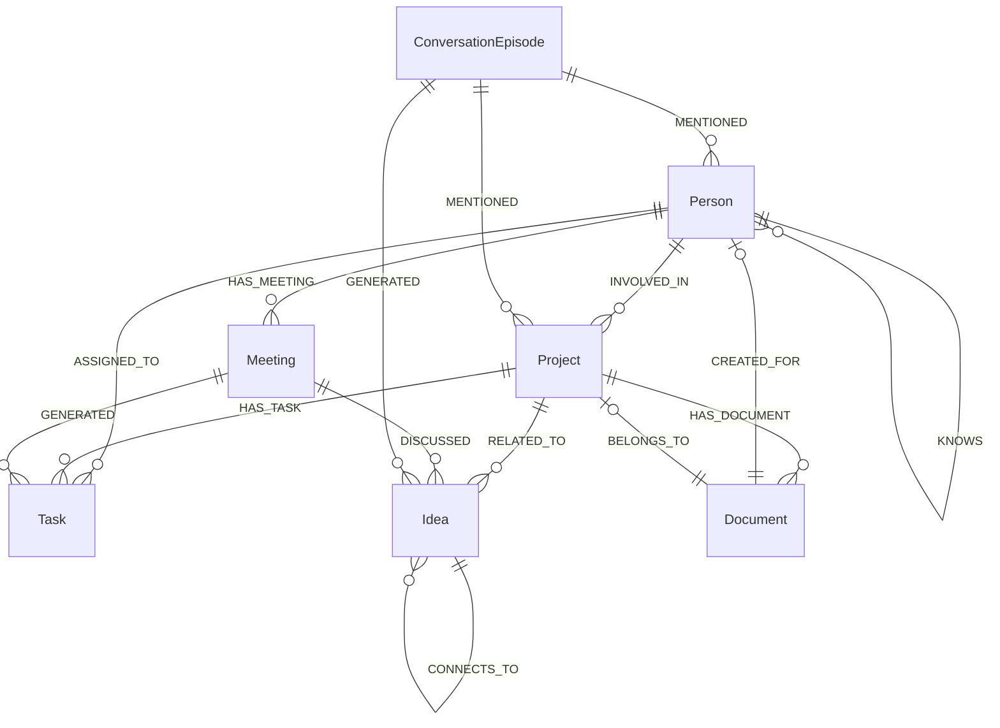

# PAI-X Daten-Schema

**Version:** 1.0
**Datum:** 2026-02-26
**Basis:** PRD v1.0

---

## Uebersicht

PAI-X nutzt drei Daten-Backends:
1. **Graphiti + FalkorDB** — Temporal Knowledge Graph (Memory, TELOS, Entitaeten)
2. **PostgreSQL 16** — Relationale Daten (Users, Sessions, Configs)
3. **Redis 7.x** — Caching, Sessions, Message Queue

---

## 1. Graphiti Node-Typen

### Person

Repraesentiert eine reale Person mit der der Nutzer interagiert.

```yaml
Person:
  id: uuid
  name: string                    # "Rudolf Meier"
  email: string                   # "rudolf@example.com" (optional)
  phone: string                   # optional
  role: string                    # "Steuerberater", "Entwickler"
  relationship: string            # "Kunde", "Kollege", "Partner", "Freund"
  company: string                 # optional, "Kanzlei Meier & Partner"
  preferences:
    communication: string         # "E-Mail", "Telefon", "Zoom"
    meeting_style: string         # "Direkt", "Ausfuehrlich"
    language: string              # "de", "en"
  notes: string                   # Freitext-Notizen
  last_contact: datetime
  created_at: datetime
  updated_at: datetime
```

### Meeting

Ein Termin oder eine Besprechung.

```yaml
Meeting:
  id: uuid
  title: string                   # "Quartalsgespraech mit Rudolf"
  date: datetime                  # Start-Zeitpunkt
  end_date: datetime              # Ende
  duration_minutes: int           # 60
  location: string                # "Zoom", "Buero Hamburg"
  participants: [Person.id]       # Teilnehmer
  summary: string                 # Zusammenfassung (nach Meeting)
  key_points: [string]            # Kernergebnisse
  action_items:
    - text: string                # "Angebot senden"
      owner: Person.id            # Wer ist verantwortlich
      due: date                   # Faelligkeitsdatum
      status: enum                # open | in_progress | done | cancelled
  mood: string                    # optional: "produktiv", "angespannt"
  calendar_event_id: string       # Google Calendar Event ID
  created_at: datetime
```

### Project

Ein aktives oder abgeschlossenes Projekt.

```yaml
Project:
  id: uuid
  name: string                    # "Agent One"
  status: enum                    # active | paused | completed | cancelled
  description: string             # Kurzbeschreibung
  start_date: date
  target_date: date               # Geplantes Enddatum
  completion: int                 # 0-100 Prozent
  last_update: datetime
  next_steps: [string]            # Naechste Schritte
  blockers: [string]              # Aktuelle Blocker
  tags: [string]                  # Kategorien
  created_at: datetime
```

### Idea

Eine erfasste Idee aus beliebiger Quelle.

```yaml
Idea:
  id: uuid
  content: string                 # "PAI-X fuer Zahnarztpraxen adaptieren"
  source: enum                    # voice | chat | manual | meeting
  category: string                # "Business", "Feature", "Content"
  status: enum                    # raw | evaluated | parked | acting_on
  evaluation: string              # optional, Agent-Bewertung
  related_projects: [Project.id]  # Verknuepfte Projekte
  created_at: datetime
```

### Task

Eine zu erledigende Aufgabe.

```yaml
Task:
  id: uuid
  title: string                   # "Angebot an Benjamin senden"
  description: string             # Details
  due_date: date
  priority: enum                  # urgent | high | medium | low
  status: enum                    # open | in_progress | done | cancelled
  related_to: [any Node.id]      # Person, Project oder Meeting
  source: string                  # "meeting", "chat", "proactive"
  created_at: datetime
  completed_at: datetime          # optional
```

### Document

Ein erstelltes oder referenziertes Dokument.

```yaml
Document:
  id: uuid
  title: string                   # "Angebot Agent One - Benjamin Arras"
  type: enum                      # offer | contract | report | note | blogpost | linkedin_post
  drive_url: string               # Google Drive URL (optional)
  local_path: string              # optional
  content_preview: string         # Erste 500 Zeichen
  related_to: [any Node.id]      # Person, Project
  summary: string                 # Automatische Zusammenfassung
  created_at: datetime
```

### ConversationEpisode

Eine einzelne Interaktion / ein Gespraech.

```yaml
ConversationEpisode:
  id: uuid
  timestamp: datetime
  channel: enum                   # chat | voice | email
  user_message: string            # Was der Nutzer gesagt hat (Zusammenfassung)
  assistant_response: string      # Was PAI-X geantwortet hat (Zusammenfassung)
  skill_used: string              # Welcher Skill aktiv war
  entities_mentioned: [any Node.id]  # Erwaehnnte Entitaeten
  learnings: [string]             # Extrahierte Erkenntnisse
  session_id: uuid                # Chat-Session
```

---

## 2. Graphiti Relationen

```
Person --[HAS_MEETING]--> Meeting
  Attribute: role (host | participant | optional)

Person --[INVOLVED_IN]--> Project
  Attribute: role (owner | contributor | stakeholder | client)

Person --[ASSIGNED_TO]--> Task
  Attribute: assigned_at (datetime)

Person --[KNOWS]--> Person
  Attribute: relationship (colleague | client | friend | partner), since (date)

Project --[HAS_TASK]--> Task
  Attribute: phase (string)

Project --[RELATED_TO]--> Idea
  Attribute: relevance (high | medium | low)

Project --[HAS_DOCUMENT]--> Document
  Attribute: document_role (deliverable | reference | internal)

Meeting --[GENERATED]--> Task
  Attribute: (keine zusaetzlichen)

Meeting --[DISCUSSED]--> Idea
  Attribute: (keine zusaetzlichen)

Meeting --[DISCUSSED]--> Project
  Attribute: (keine zusaetzlichen)

Document --[CREATED_FOR]--> Person
  Attribute: purpose (string)

Document --[BELONGS_TO]--> Project
  Attribute: (keine zusaetzlichen)

ConversationEpisode --[MENTIONED]--> Person
ConversationEpisode --[MENTIONED]--> Project
ConversationEpisode --[MENTIONED]--> Meeting
ConversationEpisode --[GENERATED]--> Idea
ConversationEpisode --[GENERATED]--> Task

Idea --[CONNECTS_TO]--> Idea
  Attribute: connection_type (complementary | contradictory | extension)
```

### Relationen-Diagramm (Mermaid)



---

## 3. TELOS Schema (Graphiti)

TELOS wird als spezieller Bereich im Graphiti-Graph gespeichert. Jede Dimension ist ein Container-Node mit untergeordneten Entry-Nodes.

### TELOS Dimension Nodes

```yaml
TelosDimension:
  id: uuid
  user_id: uuid                   # Zugehoeriger User
  dimension: enum                 # mission | goals | projects | beliefs | models |
                                  # strategies | narratives | learned | challenges | ideas
  description: string             # Beschreibung der Dimension
  last_updated: datetime
```

### TELOS Entry Nodes

```yaml
TelosEntry:
  id: uuid
  dimension_id: TelosDimension.id
  content: string                 # Der eigentliche Inhalt
  source: enum                    # user | agent
  status: enum                    # active | review_needed | completed | archived
  metadata:
    category: string              # z.B. bei GOALS: "90_days", "1_year", "5_years"
    priority: int                 # Sortierung innerhalb der Dimension
    tags: [string]
  confirmed_by_user: bool         # Bei agent-Eintraegen: vom Nutzer bestaetigt?
  created_at: datetime
  updated_at: datetime
  valid_from: datetime            # Temporale Gueltigkeit
  valid_until: datetime           # optional, wenn veraltet
```

### TELOS Relationen

```
TelosDimension --[HAS_ENTRY]--> TelosEntry
TelosEntry --[REFERENCES]--> Project       # z.B. GOALS → Project
TelosEntry --[REFERENCES]--> Person        # z.B. PROJECTS → pilot Person
TelosEntry --[DERIVED_FROM]--> ConversationEpisode  # Woher kam die Info
TelosEntry --[SUPERSEDES]--> TelosEntry    # Neuerer Eintrag ersetzt aelteren
```

### Initiale TELOS-Struktur (10 Dimensionen)

| Dimension | Kategorie-Beispiele | Update-Frequenz |
|-----------|--------------------|--------------------|
| MISSION | (einzelner Eintrag) | Selten (jaehrlich) |
| GOALS | 90_days, 1_year, 5_years | Woechentlich/Monatlich |
| PROJECTS | (pro Projekt ein Entry) | Taeglich |
| BELIEFS | business, technology, life | Selten |
| MODELS | (pro Framework ein Entry) | Selten |
| STRATEGIES | business, content, health, learning | Monatlich |
| NARRATIVES | professional, personal, elevator_pitch | Selten |
| LEARNED | (chronologisch) | Nach jeder relevanten Interaktion |
| CHALLENGES | (pro Challenge ein Entry) | Woechentlich |
| IDEAS | (chronologisch, aus allen Kanaelen) | Taeglich |

---

## 4. PostgreSQL Tables

### users

```sql
CREATE TABLE users (
    id UUID PRIMARY KEY DEFAULT gen_random_uuid(),
    email VARCHAR(255) UNIQUE NOT NULL,
    password_hash VARCHAR(255) NOT NULL,
    name VARCHAR(255) NOT NULL,
    avatar_url VARCHAR(500),
    timezone VARCHAR(50) DEFAULT 'Europe/Berlin',
    language VARCHAR(10) DEFAULT 'de',
    oauth_provider VARCHAR(50),        -- 'google', 'github', NULL
    oauth_provider_id VARCHAR(255),
    is_active BOOLEAN DEFAULT true,
    created_at TIMESTAMPTZ DEFAULT NOW(),
    updated_at TIMESTAMPTZ DEFAULT NOW()
);
```

### sessions

```sql
CREATE TABLE sessions (
    id UUID PRIMARY KEY DEFAULT gen_random_uuid(),
    user_id UUID NOT NULL REFERENCES users(id) ON DELETE CASCADE,
    refresh_token VARCHAR(500) UNIQUE NOT NULL,
    user_agent VARCHAR(500),
    ip_address INET,
    expires_at TIMESTAMPTZ NOT NULL,
    created_at TIMESTAMPTZ DEFAULT NOW()
);

CREATE INDEX idx_sessions_user_id ON sessions(user_id);
CREATE INDEX idx_sessions_expires_at ON sessions(expires_at);
```

### chat_sessions

```sql
CREATE TABLE chat_sessions (
    id UUID PRIMARY KEY DEFAULT gen_random_uuid(),
    user_id UUID NOT NULL REFERENCES users(id) ON DELETE CASCADE,
    title VARCHAR(255),                -- Auto-generiert aus erster Nachricht
    last_message_at TIMESTAMPTZ,
    message_count INT DEFAULT 0,
    created_at TIMESTAMPTZ DEFAULT NOW()
);

CREATE INDEX idx_chat_sessions_user_id ON chat_sessions(user_id);
```

### chat_messages

```sql
CREATE TABLE chat_messages (
    id UUID PRIMARY KEY DEFAULT gen_random_uuid(),
    session_id UUID NOT NULL REFERENCES chat_sessions(id) ON DELETE CASCADE,
    role VARCHAR(20) NOT NULL,         -- 'user' | 'assistant'
    content TEXT NOT NULL,
    skill_used VARCHAR(100),           -- NULL oder Skill-ID
    sources JSONB,                     -- Genutzte Memory-Nodes
    feedback_rating VARCHAR(20),       -- 'positive' | 'negative' | NULL
    feedback_comment TEXT,
    created_at TIMESTAMPTZ DEFAULT NOW()
);

CREATE INDEX idx_chat_messages_session_id ON chat_messages(session_id);
CREATE INDEX idx_chat_messages_created_at ON chat_messages(created_at);
```

### skill_configs

```sql
CREATE TABLE skill_configs (
    id UUID PRIMARY KEY DEFAULT gen_random_uuid(),
    user_id UUID NOT NULL REFERENCES users(id) ON DELETE CASCADE,
    skill_id VARCHAR(100) NOT NULL,    -- 'calendar_briefing', 'content_pipeline', etc.
    active BOOLEAN DEFAULT true,
    autonomy_level INT DEFAULT 3 CHECK (autonomy_level BETWEEN 1 AND 5),
    config JSONB DEFAULT '{}',         -- Skill-spezifische Konfiguration
    created_at TIMESTAMPTZ DEFAULT NOW(),
    updated_at TIMESTAMPTZ DEFAULT NOW(),
    UNIQUE(user_id, skill_id)
);
```

### skill_executions

```sql
CREATE TABLE skill_executions (
    id UUID PRIMARY KEY DEFAULT gen_random_uuid(),
    user_id UUID NOT NULL REFERENCES users(id) ON DELETE CASCADE,
    skill_id VARCHAR(100) NOT NULL,
    status VARCHAR(20) NOT NULL,       -- 'success' | 'error' | 'timeout'
    input_summary TEXT,                -- Zusammenfassung des Inputs
    output_summary TEXT,               -- Zusammenfassung des Outputs
    duration_ms INT,                   -- Ausfuehrungszeit
    error_message TEXT,                -- Bei Fehler
    metadata JSONB DEFAULT '{}',
    created_at TIMESTAMPTZ DEFAULT NOW()
);

CREATE INDEX idx_skill_executions_user_skill ON skill_executions(user_id, skill_id);
CREATE INDEX idx_skill_executions_created_at ON skill_executions(created_at);
```

### notification_settings

```sql
CREATE TABLE notification_settings (
    id UUID PRIMARY KEY DEFAULT gen_random_uuid(),
    user_id UUID UNIQUE NOT NULL REFERENCES users(id) ON DELETE CASCADE,
    daily_briefing_enabled BOOLEAN DEFAULT true,
    daily_briefing_time TIME DEFAULT '07:30',
    pre_meeting_enabled BOOLEAN DEFAULT true,
    pre_meeting_minutes INT DEFAULT 60,
    follow_up_enabled BOOLEAN DEFAULT true,
    follow_up_hours INT DEFAULT 48,
    deadline_warning_enabled BOOLEAN DEFAULT true,
    deadline_warning_hours INT DEFAULT 72,
    idea_synthesis_enabled BOOLEAN DEFAULT true,
    idea_synthesis_day VARCHAR(10) DEFAULT 'sunday',  -- Wochentag
    idea_synthesis_time TIME DEFAULT '10:00',
    channels JSONB DEFAULT '{"telegram": true, "pwa_push": true, "email": false}',
    telegram_chat_id VARCHAR(100),
    created_at TIMESTAMPTZ DEFAULT NOW(),
    updated_at TIMESTAMPTZ DEFAULT NOW()
);
```

### notifications

```sql
CREATE TABLE notifications (
    id UUID PRIMARY KEY DEFAULT gen_random_uuid(),
    user_id UUID NOT NULL REFERENCES users(id) ON DELETE CASCADE,
    type VARCHAR(50) NOT NULL,         -- 'daily_briefing', 'pre_meeting_alert', etc.
    title VARCHAR(255) NOT NULL,
    content TEXT NOT NULL,
    action_url VARCHAR(500),
    read BOOLEAN DEFAULT false,
    sent_channels JSONB DEFAULT '[]',  -- ['telegram', 'pwa_push']
    created_at TIMESTAMPTZ DEFAULT NOW()
);

CREATE INDEX idx_notifications_user_unread ON notifications(user_id, read);
CREATE INDEX idx_notifications_created_at ON notifications(created_at);
```

### integration_tokens

```sql
CREATE TABLE integration_tokens (
    id UUID PRIMARY KEY DEFAULT gen_random_uuid(),
    user_id UUID NOT NULL REFERENCES users(id) ON DELETE CASCADE,
    provider VARCHAR(50) NOT NULL,     -- 'google', 'telegram', 'github'
    access_token TEXT NOT NULL,        -- Verschluesselt
    refresh_token TEXT,                -- Verschluesselt
    scopes VARCHAR(500),
    expires_at TIMESTAMPTZ,
    created_at TIMESTAMPTZ DEFAULT NOW(),
    updated_at TIMESTAMPTZ DEFAULT NOW(),
    UNIQUE(user_id, provider)
);
```

---

## 5. Redis Nutzung

### Session Store
```
Key:    session:{user_id}
Value:  JSON { jwt, last_active, device_info }
TTL:    24h (konfigurierbar)
```

### Cache — Graphiti Context
```
Key:    graphiti:context:{user_id}:{query_hash}
Value:  JSON { nodes, telos_snapshot, timestamp }
TTL:    5 Min (kurz, da Kontext sich aendern kann)
```

### Cache — Calendar Events
```
Key:    calendar:events:{user_id}:{date}
Value:  JSON [ events ]
TTL:    15 Min
```

### Cache — TELOS Snapshot
```
Key:    telos:{user_id}
Value:  JSON { alle 10 Dimensionen kompakt }
TTL:    10 Min (invalidiert bei Update)
```

### Message Queue (Celery)
```
Broker:     redis://redis:6379/1
Backend:    redis://redis:6379/2

Queues:
  - default          # Standard-Tasks
  - proactive        # Proaktive Trigger (Briefings, Alerts)
  - memory           # Graphiti Updates (niedrigere Prioritaet)
```

### Rate Limiting
```
Key:    ratelimit:{user_id}:{endpoint}
Value:  Counter
TTL:    1 Min
Limit:  60 Requests/Min (konfigurierbar)
```

### Real-time (Socket.io Adapter)
```
Redis wird als Socket.io Adapter genutzt fuer:
- Chat-Streaming Sessions
- Notification Broadcasting
- Spaeter: Multi-Device Sync
```

---

## 6. Datenfluss-Zusammenfassung

```
Nutzer-Input
    │
    ▼
PostgreSQL: Chat-Message gespeichert
    │
    ▼
Redis: Context-Cache geprueft
    │
    ├─ Cache Hit → Graphiti-Kontext aus Cache
    │
    ├─ Cache Miss → Graphiti/FalkorDB: Kontext geladen → Cache geschrieben
    │
    ▼
Redis: TELOS-Snapshot geladen (oder aus Graphiti refreshed)
    │
    ▼
LLM Processing (Anthropic Claude API)
    │
    ▼
PostgreSQL: Antwort in chat_messages gespeichert
    │
    ▼
Graphiti/FalkorDB: ConversationEpisode + Updates (async via Celery)
    │
    ▼
Redis: Betroffene Caches invalidiert
```
